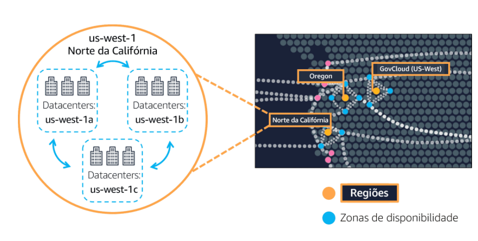
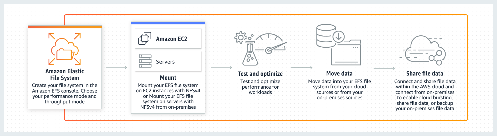
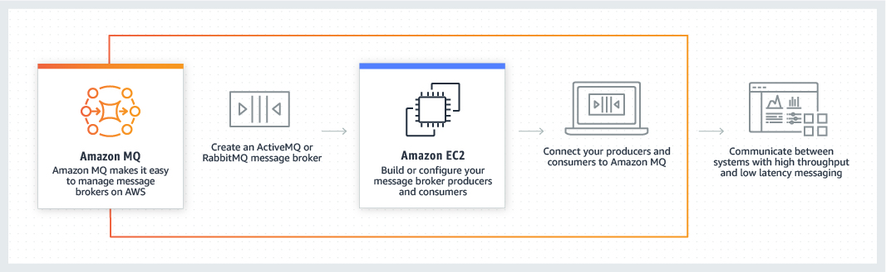

# **AWS Certified Cloud Practitioner (CLF-C01)**

# **Documentação Oficial**

https://aws.amazon.com/pt/certification/certified-cloud-practitioner/?ch=tile&tile=getstarted

## **Guia do Exame**

https://d1.awsstatic.com/pt_BR/training-and-certification/docs-cloud-practitioner/AWS-Certified-Cloud-Practitioner_Exam-Guide.pdf

**Domain 1: Cloud Concepts (26%)**

1.1 Definir a nuvem AWS e sua proposta de valor

1.2 Identificar aspectos da economia da nuvem AWS

1.3 Liste os diferentes princípios de design de arquitetura de nuvem

**Domain 2: Security and Compliance (25%)**

2.1 Definir o modelo de responsabilidade compartilhada da AWS

2.2 Definir os conceitos de segurança e conformidade da nuvem AWS

2.3 Identifique os recursos de gerenciamento de acesso da AWS

2.4 Identificar recursos para o suporte de segurança

**Domain 3: Technology (33%)**

3.1 Definir métodos de implantação e operação na nuvem AWS

3.2 Definir a infraestrutura global da AWS

3.3 Identificar os principais serviços da AWS

3.4 Identificar recursos para suporte de tecnologia

**Domain 4: Billing and Pricing (16%)**

4.1 Comparar os vários modelos de preços para AWS

4.2 Reconhecer as várias estruturas de conta em relação ao faturamento e preços da AWS

4.3 Identificar recursos disponíveis para suporte de faturamento

## **Perguntas exemplos**

https://d1.awsstatic.com/pt_BR/training-and-certification/docs-cloud-practitioner/AWS-Certified-Cloud-Practitioner_Sample-Questions.pdf

# **Treinamentos**

Colocar ✔ quando concluído. 

## **AWS**

https://d1.awsstatic.com/training-and-certification/ramp-up_guides/Ramp-Up_Guide_CloudPractitioner.pdf

**AWS Partner - Accreditation Business** ✔

https://explore.skillbuilder.aws/learn/course/internal/view/elearning/2427/aws-partner-accreditation-business-digital

https://explore.skillbuilder.aws/learn/course/internal/view/elearning/2249/aws-partner-accreditation-business-digital-portuguese

 

**AWS Partner Accreditation - Technical** ✔

https://explore.skillbuilder.aws/learn/course/internal/view/elearning/1096/aws-partner-accreditation-technical

https://explore.skillbuilder.aws/learn/course/internal/view/elearning/2314/aws-partner-accreditation-technical-portuguese

 

**AWS Cloud Practitioner Essentials**✔

https://explore.skillbuilder.aws/learn/course/internal/view/elearning/134/aws-cloud-practitioner-essentials

https://explore.skillbuilder.aws/learn/course/internal/view/elearning/8287/aws-cloud-practitioner-essentials-portugues

 

 **AWS Cloud Practitioner Essentials - Final Assessment✔**

https://explore.skillbuilder.aws/learn/course/internal/view/elearning/3010/aws-partner-aws-cloud-practitioner-essentials

[assessment](https://explore.skillbuilder.aws/learn/course/3010/play/11028/aws-partner-aws-cloud-practitioner-essentials-assessment)

 

**AWS Cloud Practitioner - Exam Guide**✔

https://d1.awsstatic.com/training-and-certification/docs-cloud-practitioner/AWS-Certified-Cloud-Practitioner_Exam-Guide.pdf

https://d1.awsstatic.com/pt_BR/training-and-certification/docs-cloud-practitioner/AWS-Certified-Cloud-Practitioner_Exam-Guide.pdf

 

**AWS Cloud Practitioner - Sample Questions✔**

https://d1.awsstatic.com/training-and-certification/docs-cloud-practitioner/AWS-Certified-Cloud-Practitioner_Sample-Questions.pdf

https://d1.awsstatic.com/pt_BR/training-and-certification/docs-cloud-practitioner/AWS-Certified-Cloud-Practitioner_Sample-Questions.pdf

 

## ACLOUDGURU

https://learn.acloud.guru/course/aws-certified-cloud-practitioner/dashboard **✔**

## UDEMY

[NEW] Ultimate AWS Certified Cloud Practitioner - 2021✔

# **Workshops**

https://maturitymodel.security.aws.dev/en/

# **Simulados**

## **Whizlabs**

https://www.whizlabs.com/learn/course/aws-certified-cloud-practitioner/219

# **Services (Serviços)**

## **Infrastructure Global (Infraestrutura Global)**	

### **Regions (Regiões)**

https://aws.amazon.com/pt/about-aws/global-infrastructure/regions_az/?p=ngi&loc=2

- **Pode ter 2 ou mais AZ´s em uma região**

  

  
  
  

### **Zonas de disponibilidades (AZ)**

https://aws.amazon.com/pt/about-aws/global-infrastructure/regions_az/?p=ngi&loc=2

- Interconectas por uma fibra
- Um ou mais DataCenters no mesmo local
- **Pode ter 1 ou mais AZ´s em uma região**
- As AZ´s são vinculadas a uma única região
- Conectividade redundante de baixa latência 

### **Edge Location - PoP - Pontos de Presenças**

- Cache
- CDN - Rede de Entrega de Conteúdo
- Reduz latência
- É como um mini datacenter, mas não tem infra como EC2

### **AWS Local Zones**

https://aws.amazon.com/pt/about-aws/global-infrastructure/localzones/

O AWS Local Zones é uma espécie de implantação de infraestrutura posiciona a computação, armazenamento, banco de dados e outros produtos seletos da AWS perto do público em geral e dos centros industriais.

- **Summary**
  - Extent your VPC

## **Analytics (Análise)**	

### **Athena**

https://aws.amazon.com/athena/

- **Summary**

  - **É um serviço de consulta interativo que facilita a análise de dados no Amazon S3 usando SQL padrão.** 
  - Serveless

  - SQL Languege

    - Casos de uso

      - BI

      - Analytics

      - Report and Analyze

        

  - Support
    - CVS
      - JSON
      - ORC
      - AvroParquet

### **Kinesis**

- **Summary**
  - Torna mais fácil coletar, processar e analisar dados de streaming em tempo real para que você possa obter insights oportunos e reagir rapidamente a novas informações. 
  - Kinesis oferece quatro serviços: 
    - Data Firehose
    - Data Analytics
    - Data Streams
    - Video Streams
  - Real time big data streaming

### **QuickSight**

https://aws.amazon.com/pt/quicksight/

- **Summary**

  - Criação de relatórios inteligentes

  - BI

  - Integra: RDS, S3, Athena, RedShift

    

## **Storage (Armazenamento)** 	

### **Simple Storage Service (S3)**

https://aws.amazon.com/s3/

- **Summary**

  - Armazenamento a nível de objeto
  - **key - Prefix + Object Name**
    - s3://my-bucket/my_file.txt
  - Upload de arquivos de até 5 TB
  - Multipart upload - 5 GB
  - **Serviço regional mas com o nome global**
  - **Cópia de dados de uma instância EC2 para um bucket S3 na mesma região, não tem custo.**
  - Pode usar com o CloudFront, Redshift, Athena, Mobile applications
  - **Não suporta operações de acréscimo de arquivo**

- **Casos de Uso**

  - Backup - Storage
  - DR
  - Archive
  - Hybrid Cloud Stporgae
  - App Hosting
  - Media Hosting
  - DataLakes
  - Software delivery
  - Static websites

  

- **S3 Encryption**

  - **No Encryption**

    - O arquivo não é Encryptado  

  - **Server-Side Encryption**

    - O arquivo é Encryptado  depois de recebe-lo

  - **Client-Side Encryption**

    - O arquivo é Encryptado antes de envia-lo

      

- **S3 Replication (CRR & SRR)**
  - CRR - Cross Region Replication
    - Setup em cada região
    - Read Only
  - SRR - Same Region Replication
  - Copia assincrona
  - Buckets devem estar em diferentes contas
  - Enable Versioning

- **S3 Access Logs**
  - Auditoria
  - Salva em outro S3

- **S3 Versioning**

  - Best Practice

  - Suspender o versionamento não deleta o arquivo

    

- **S3 Websites**

  - URL
    - <bucket-name>.s3-website-<aws-region>.amazonaws.com
    - <bucket-name>.s3-website.<aws-region>.amazonaws.com

- **S3 Security**

  - **User based**
    - IAM Policies
    - IAM Roles

  - **Resource Based**

    - Bucket polices

      - Object Access control list - ACL

      - Bucket Access control list - ACL

  - **Encryption**

- **AWS S3 Transfer Acceleration**
  - Transferências rápidas e seguras em longas distancias para bucket utilizando os pontos de presenças.
  - Edge Locations 
  - Usa rede interna AWS

- **S3 Object Lock & Glacier Vault Lock**

  - **Object Lock** 

    -  É usado para evitar que um objeto seja excluído ou sobrescrito por um período de tempo fixo ou indefinidamente. 

    - WORM (Write Onde Read Many)

    - Bloqueia a deleção do objeto

      

  - **Glacier Vault Lock**

    - Permite que você implemente e aplique facilmente controles de conformidade para cofres S3 Glacier individuais com uma política de bloqueio de cofre.
    - Pode especificar controles como “escrever uma vez, ler várias” (WORM) em uma política de bloqueio de cofre e bloquear a política de edições futuras. 
    - **Uma vez bloqueada, a política não pode mais ser alterada.**
    - WORM (Write Onde Read Many)
    - Compliance

    

- **Classses de Armazenamento**

  https://aws.amazon.com/pt/s3/storage-classes/

  

  - **S3 Standard - General Purpose**

    - 99,99% Availability

    - Replicas em multi-az

    - **Recomentado para Acesso Frequente**

    - **Não cobra Restore**
    
    -  O S3 Standard **não tem restrição de duração mínima** de armazenamento para objetos.
  
      
  
  - **S3 Standard Infrequent Access (IA)**

    - 99,99% Availability
- Low cost compatado com S3 Standard
    - Armazena dados em uma única zona de disponibilidade
- Tem um preço de armazenamento menor do que o S3 Standard – IA
    - **Recomentado para Acesso Infrequente**

- **S3 One Zone-Infrequent Access (S3 One Zone – IA)**
  - 99,5% Availability

  - **Armazena dados em uma única zona de disponibilidade**

  - Tem um preço de armazenamento menor do que o S3 Standard – IA
  - **Recomentado para Acesso Infrequente**

    - **S3 Intelligent-Tiering (Estratificação inteligente do S3)**

      - 99,99% Availability
      - Move os arquivos para Acesso Frequente ou Acesso Infrequente automaticamente
      - Ideal para dados com padrões de acesso desconhecidos ou em alteração
      - Requer uma pequena taxa mensal de monitoramento e automação por objeto
      - Rapidez quando necessário
      - Replicas em multi-az
      - **Recomentado para quando não se sabe o tipo de acesso**
      - **não tem restrição de duração mínima** de armazenamento para objetos.
      **Não cobra Restore**

​      

    - **S3 Glacier**
    
      - Arquivamento e backup de dados
      - Baixo custo
      - **Restore**
        - Expedited - 1 a 5 min
        - Standard - 3 a 5 Horas
        - Bulk - 5 a 12 horas
      - Criar cofres
      - Criptografia habilitada por padrão
      - Controles de escritas e leituras
      - Restore em minutos e horas

​      

    - **AWS S3 Glacier Deep** **Archive**
    
      - **Armazenamento mais barato**
    
      - Não faz upload de arquivos pela Console
    
      - **Restore**
    
        - Standard 12 horas 
        - Bulk 48 horas

​        

    - **S3 Outposts**

      - Local S3

​        

### **AMI**

- Imagens customizadas para EC2
- Podem ser copiadas entre regiões
- Pode criar uma AMI através de um snapshot

### **EC2 Image Builder**

https://aws.amazon.com/pt/image-builder/

- Automatiza a criação, manutenção, validação e teste de AMI´s
- Para EC2 e Imagens de Containers

### **EC2 Instance Store**

- Ephemeral
- Buffer, cache e dados temporários 
- Melhor I/O

### **Elastic Block Store (EBS)**

https://aws.amazon.com/pt/ebs/

- Armazenamento a nível de bloco

- Independente da vida útil da instância

- **Snapshots são armazenados de forma incremental, é cobrado pelos blocos alterados armazenados**

- É **automaticamente replicado** entre AZ´s

- **Mas é armazenado em uma única AZ** 

- É cobrado pelo Tipo e pelo IOPS provisionado.

- Snapshot point-in-time

- Snapshots podem ser copiados entre Regiões

- Ate 16 TiB

- **Pode ser anexado a uma única instância na mesma Zona de disponibilidade**

- Flag - Delete on Termination 

  - Para deletar o EBS quando deleta a EC2
  - Não vem ativado por default

  

  

### **Elastic File System (EFS)**

https://aws.amazon.com/pt/efs/

- Compartilhamento de arquivos
- Sistema de Arquivos Linux
- Só funciona em SO Linux
- Suporte a alta disponibilidade 
- Para acessar os sistemas de arquivos EFS no local, você deve ter um AWS Direct Connect ou conexão VPN da AWS entre o datacenter local e o Amazon VPC.
- Regional
- NFS
- **As instâncias EC2 podem acessar arquivos em um sistema de arquivos EFS em muitas zonas de disponibilidade, regiões e VPCs**
- **Paga por uso de ler ou gravar dados**

### **Amazon FSx**

https://aws.amazon.com/pt/fsx/

- **Lustre**
  - HPC
- **Windows File Server**
  - Suporta SMB e Windows NTFS
  - Windows File Server
  - Integrado com Active Directory
- **NetApp**
- **OpenZFS**

### **Storage Gateway**

- **Summary**

  - Storage Hibrido

  

- **Tipos de Storage Gateway**

  - File Gateway
  - Volume Gateway
  - Tape Gateway

### 

## **Database (Banco de Dados)** 	

### **RDS**

- São beneficios Patches e backups automatizados

- OLTP

- São beneficios o redimencionamento da capacidade de acordo com uso

- MySQL, Oracle, PostgreSQL, Microsoft SQL

- **Deploy Multi-Region**

  - Read Replicas

  - Varias AZs

  - DR

  - Local Performance

    

- **Read Replicas**

  - Pode criar até 5 Read Replicas
  - **Você pode usar réplicas de leitura para melhorar o desempenho de leitura e também para recuperação de desastres**

- **Multi-AZ**

  https://aws.amazon.com/rds/features/multi-az/

  - Failover

  - Alta Disponibilidade

  - Replica para outra AZ

    

  
  
  

### **Aurora**

- **Summary**

  - Forcene poder computacional até 5x mais rápido que bd mysql tradicional

  - Forcene poder computacional até 3x mais rápido que bd postgreSQL tradicional

  - Banco de dados relacional

  - Aumenta o storage automaticamente de 10 GB até 64 Tb

  - Mysql e PostgreSQL

  - 6 Cópias

  - 15 replicas de leitura

  - Bkp continuo no S3

### **DocumentDB**

- **Summary**

  - Banco de dados NoSQL

  - MongoDB

  - Replication acroos 3 AZ

  - Aumenta o storage automaticamente de 10 GB até 64 Tb

    

  

### **DynamoDB**

https://aws.amazon.com/dynamodb

- **Summary**

  - Banco de dados NoSQL
  
  - Permite que um banco de dados tenha um **esquema flexível** e ofereça suporte a modelos de dados de documentos
  
  - key/value database
  
  - Replication em 3 AZ
  
  - Serverless
  
  - **Não suportam um esquema pré-definido**
  
  - Oferecem atomicidade
  
  - Modelo de dados flexíveis e latência de milissegundos de um digito
  
  - Para jogo on-line
  
  - Fortimente Consistente
  
    

- **Global Table**
  - Acesso a tabelas em multiplas regions com low latency
  - Tabelas globais
  - Replicação ativa/ativa

- **DynamoDB Accelerator(DAX)** 
  - Aprimora o desempenho de leitura, leitura pesada
  - 10x mais performance
  - Uso exclusivo para DynamoDB
  - **Cache para DynamoDB**

### **ElastiCache**

- Cache in Memory

- Low Latency

- Pode colocar na frente do banco

- Redis / Memcached

  

### **Neptune**

- **Summary**
  - Banco de dados em Grafos
  - Social Network
  - Replica 3 AZ
  - 15 Read replicas

### **Glue**

https://aws.amazon.com/glue/

- **Summary**

  - AWS Glue é um serviço de **extração, transformação e carregamento (ETL)** totalmente gerenciado que torna mais fácil para os clientes preparar e carregar seus dados para análise. 
  - O trabalho AWS Glue deve ser usado para processamento de dados ETL em lote.
  - Serverless

  

- **Glue Data Catalog**

  - É um repositório central para armazenar metadados estruturais e operacionais para todos os seus ativos de dados.

  - Athena

  - Redshift 

  - EMR

    

### **Redshift**

- **Summary**

  - Data Warehouse

  - PBs (Petabytes)

  - OLAP - Online analytical Processing

  - 10x mais performance

  - MPP - Massive Parallel Query Excecution

  - Integrado - AWS Quicksight ou Tableau 

### **Elastic MapReduce (EMR)**

- **Summary**

  - Hadoop 

  - Apache Spark, HBase, Presto, Flink

  - Usa Spot Instance

  - Casos de uso
    - Data Processing
      - Machine Learnig
      - Web Indexing
      - Big Data

### **Amazon Managed Blockchain**

- **Summary**
  - É um serviço totalmente gerenciado que facilita a criação e o gerenciamento de redes blockchain escalonáveis
  - Ele permite que várias partes executem transações sem a necessidade de uma autoridade central confiável.
  - **Existe um aspecto de descentralização**
  - Ethereum / Hyperledger Fabric

### **Amazon Quantum Ledger Database (QLDB)**

- **Summary**

  - É um banco de dados de contabilidade totalmente gerenciado que fornece um log de transações transparente, imutável e criptograficamente verificável de propriedade de uma autoridade central confiável. 

  - Imutável 

  - Recording finacial transactions

  - Replica em 3AZ

  - Criptografado

  - SQL

  - Não há conceito de descentralização

    

### **Database Migration Service (DMS)**

- **Summary**

  - Migra bd do local para AWS

  - Migra bd da AWS para Local

  - Migra bd do EC2 para RDS

  - Migra Redshift para DynamoDB

  - **O banco de dados de origem permanece operacional durante a migração**

  - Consolidação de banco de dados

  - DR

## **AWS Support Plans**

- **Support Plans Types**

  - **Basic**
  
    - **Não** oferecem suporte ao acesso a orientação, configuração e solução de problemas de interoperabilidade da AWS com software de terceiros.
  
      

  - **Developer**
  
    - **Não** oferecem suporte ao acesso a orientação, configuração e solução de problemas de interoperabilidade da AWS com software de terceiros.
  
    - Permite que um contato abra casos ilimitados
  
      
  
  - **Business**
  
    - Acesso a todos os itens do Trust Advidor
  
    - API Access
  
    - Orientação, configuração e solução de problemas de interoperabilidade AWS com muitos sistemas operacionais comuns
  
    - Você obtém acesso ao Gerenciamento de eventos de infraestrutura por uma taxa adicional.
  
    - **Orientação arquitetônica no contexto de seus casos de uso específicos.**
  
      
  
  - **Enterprise**
  
    - Acesso a todos os itens do Trust Advidor
    - Orientação, configuração e solução de problemas de interoperabilidade AWS com muitos sistemas operacionais comuns
    - TAM
    - Concierge
    - < 15 minutos
    - API Access
    - Acesso a treinamento online com laboratórios individualizados.

## **Compute (Computação)**	

### **AWS Outposts**

https://aws.amazon.com/outposts/

- Infraestrutura da AWS no cliente
- Hybrid Cloud
- Você é responsável pela infra, segurança e etc
- EC2, EBS, S3,EKS ECS, RDS e EMR

### **AWS WaveLength**

O AWS Wavelength incorpora serviços de computação e armazenamento da AWS em redes 5G, fornecendo infraestrutura de computação de borda móvel para desenvolvimento, implantação e escalabilidade de aplicações de latência ultrabaixa.

https://aws.amazon.com/pt/wavelength/

- **Summary**
  - Telecom 5G network

### **AWS Auto Scaling**

https://aws.amazon.com/autoscaling/

https://docs.aws.amazon.com/autoscaling/plans/userguide/what-is-aws-auto-scaling.html

- **Scaling Strategies** 

  - **Dynamic Scaling**

    - **Simple/Step Scaling**

      - Quando utilizamos alarmes do CloudWatch (CPU > 70%)

    - **Target Tracking Scaling**

      - Quando utilizamos a média de consumo do ASG

    - **Scheduled Scaling**

      - Quando o scheduler é feito por agendamento

    - **Predictive Scaling**

      - Utiliza Machine Learning

        

  - **Manual Scaling**

    - Quando alteramos na mão

- **Scaling-up** adciona mais recursos a uma instancia e **scaling-out** adciona mais instâncias 
- **Scaling-up** - **Vertical Scaling** - Aumentar o tamanho da instancia
- **Scaling-out** - **Horizontal Scaling** - Aumenta o numero de instâncias 

### **Batch**

https://aws.amazon.com/batch/

- **Summary**
  - Executar milhares de jobs
  - Ele gerancia as EC2 ou Spot
  - Docker Images e roda no ECS

### **EC2 (Elastic Compute Cloud)**

- Serviço que vc tem controle total

- **EC2 Instance Connect** 

  - Connecta na EC2 via console AWS

    

- **EC2 UserData**

  - bootstrap

  - executa no primeiro boot

    

- **SO** 

  - Linux, Windows e MAcOS

    

- **Benefícios da EC2** 

  - Elasticidade, Flexível

  - Integração com demais serviços

  - Confiável

  - Seguro

  - Baixo Custo

    

- **Tipos de Instâncias** 

  https://aws.amazon.com/pt/ec2/instance-types/

  - **General Purpose**

    - Instâncias de uso geral fornecem um equilíbrio de recursos de computação, memória e rede e podem ser usadas para diversas cargas de trabalho. 

      

  - **Compute Optimized**

    - As instâncias otimizadas para computação são ideais para aplicativos vinculados a computação que se beneficiam de processadores de alto desempenho. 

      - Batch

      - Media

      - HPC

      - Machine Learning

        

  - **Memory Optimized**

    - As instâncias otimizadas de memória são projetadas para fornecer desempenho rápido para cargas de trabalho que processam grandes conjuntos de dados na memória.

      

  - **Accelerated Computing**

    - Instâncias de computação aceleradas usam aceleradores de hardware, ou coprocessadores, para executar funções, como cálculos de número de ponto flutuante, processamento de gráficos ou correspondência de padrões de dados, mais eficientemente do que é possível no software em execução nas CPUs.

      

  - **Storage Optimized**

    - As instâncias otimizadas para armazenamento são projetadas para cargas de trabalho que exigem acesso de leitura e gravação sequencial alto a conjuntos de dados muito grandes no armazenamento local. Elas

      

  - **Instances Features**

  - **Measuring Instance Performance**

    

- **EC2 Dedicated Hosts**

  https://docs.aws.amazon.com/AWSEC2/latest/UserGuide/dedicated-hosts-overview.html
  
  https://aws.amazon.com/pt/ec2/dedicated-hosts/
  
  - Podem utilizar licenças de software existentes no cliente - BYOL

- **EC2 Dedicated Instances**

  https://aws.amazon.com/pt/ec2/pricing/dedicated-instances/

  - Roda em hardware dedicado mas vc não tem acesso 

    

- **Preços**

  - **Sob-Demanda** 

    **https://aws.amazon.com/blogs/aws/new-per-second-billing-for-ec2-instances-and-ebs-volumes/**

    - **Por hora ou por segundo**

    - **60 segundos é a cobrança mínima** 

      

  - **Saving Plans** 

    - 1 ou 3 anos 

    - **Até 72% de desconto comparado ao sob-demanda**
  
    - **EC2 Saving Plans**
  
      - **Até 72% de descontos**
      - Individual instances
  
    - **Compute Saving Plans**
  
      - Mais flexível
      - EC2, Fargate e Lambda

      
  
  - **Instâncias Reservadas**

    - 1 ou 3 Anos

    - Standard, Convertable ou Scheduled
  
      
  
  - **Instâncias Spot**
  
    https://aws.amazon.com/ec2/spot/
    
    - Aviso de até **2 minutos**
    - **Até 90% de desconto comparado ao sob-demanda**
    - Cargas de trabalhos em lote
    
    
  

### **AWS Compute Optimizer**

https://aws.amazon.com/compute-optimizer/

- Recomendações de custos e performance
- Usa machine learning
- Recursos Suportados
  - EC2
  - EC2 AutoScaling Groups
  - EBS
  - Lambda

### **AWS Cloud Adoption Framework**

https://d1.awsstatic.com/whitepapers/aws_cloud_adoption_framework.pdf

- **Perspectiva de operações** do AWS Cloud Adoption Framework também inclui princípios para operar na nuvem usando melhores práticas ágeis.
- **A Perspectiva de Negócios** ajuda você a mudar de um modelo que separa as estratégias de negócios e TI para um modelo de negócios que integra a estratégia de TI.
- **A Perspectiva de Pessoa**s ajuda os funcionários de Recursos Humanos (RH) a prepararem suas equipes para adoção da nuvem, atualizando processos organizacionais e habilidades de equipe para incluir competências baseadas em nuvem.
- **A Perspectiva de Governança** ajuda você a entender como atualizar as habilidades da equipe e os processos organizacionais necessários para garantir a governança de negócios na nuvem.

### **Lightsail**

https://aws.amazon.com/lightsail/

- **Summary**

  - Projetos pequenos
  - Sem experiencia em Cloud
  - EC2, Storage, Database e Rede

  - Deployments rápidos

  - LAMP, Nginx, Plesk, Wordpress
  - Dev/Test

  - Similar ao Quick Starts

### **Elastic Load Balancing (ELB)**	

https://aws.amazon.com/pt/elasticloadbalancing/

- **Tipos** 
  - **Gateway** 
  - **Application** 
    - (http/https only) 
    - Layer 7
  - **Network** 
    - (ultra-high performance / TCP) 
    - Layer 4
  - **Classic** 
    - (Layer 4 and Layer 7)

- É regional
- É altamente disponível 

### **Lambda**

https://aws.amazon.com/pt/lambda/

- **Serverless**

- Escalável e disponível 

- **Pagamento  por Requisições e Duração**

- Execuções curtas

- **Regional**

- Executar em até **15 minutos** (timeout)

- Resposta a eventos (trigger)

- Free Tier - 1 Million request each month 

- **Event-Driver** - Reativo por triggers

- 10 GB de RAM

  

### **Elastic Container Registry (ECR)** 

https://aws.amazon.com/ecr/

- É ser usado para armazenar, gerenciar e implantar imagens de contêiner Docker. 
- Armazena as imagens docker
- Privado

### **Elastic Container Service (ECS)** 

https://aws.amazon.com/ecs/

- Ferramenta de orquestração de container
- Integra com ALB
- Gerencia a EC2

### **Elastic Kubernets Service (EKS)**

https://aws.amazon.com/pt/eks/

- **Summary**
- Ferramenta de orquestração de container

  - Gerencia a EC2

    

### **Fargate**

https://aws.amazon.com/fargate/

- **Summary**

  - **Serveless**

  - Para ECS e EKS

  - Escala automaticamente

  - **Não gerencia a EC2**

  - Especifica CPU/RAM para container

### **API Gateway**	

- **Summary**
  - Expõe API´s
  - Serverless
  - RestFull e Websocket

### **SES Simple Email Services**

- Configurar um **VPC Endpoint com AWS PrivateLink** para alcançar dentro da VPC

## **Developer Tools(Ferramentas Desenvolvedor)** 	

### **Cloud9**

- É um ambiente de desenvolvimento integrado (IDE) baseado em nuvem que permite escrever, executar e depurar seu código com apenas um navegador.

- Cloud IDE

- Escrever o código

- Colaboração in real-time

  

### **CodeArtifact**

- É um serviço de repositório de artefato totalmente gerenciado (também chamado de dependências de código) que torna mais fácil para organizações  qualquer tamanho armazenar, publicar e compartilhar com segurança pacotes de software usados em seu processo de desenvolvimento de software.

### **CodeBuild**

https://docs.aws.amazon.com/codebuild/latest/userguide/welcome.html

- É um serviço de integração contínua totalmente gerenciado que compila o código-fonte, executa testes e produz pacotes de software prontos para implantação. 
- Com CodeBuild, você não precisa provisionar, gerenciar e dimensionar seus próprios servidores de construção, ele não tem servidor.

- Build Code

  

### **CodeCommit**

https://aws.amazon.com/pt/codecommit/

- É um serviço de controle de origem gerenciado, seguro e altamente escalonável que torna mais fácil para as equipes colaborarem no código. Ele também fornece controle de versão de software.

- Armazenamento de código fonte

- Use Git technology

  
  
  

### **CodeDeploy**

https://docs.aws.amazon.com/codedeploy/latest/userguide/welcome.html

-  É um serviço que automatiza **implantações de código** para qualquer instância, incluindo instâncias do Amazon EC2 e instâncias em execução no local.

- Automatizar a instalação de um conjunto de aplications em **EC2 e em Servidores Locais**

- Deploy da aplicação automaticamente

- **Hybrid Service**

- Precisa CodeDeploy agent para instâncias ou servidores locais

  
  
  

### **CodePipeline**

- É um serviço de entrega contínua totalmente gerenciado que ajuda a automatizar seus pipelines de lançamento para aplicativos rápidos e confiáveis e atualizações de infraestrutura. 

- Orquestrador de diversos "steps"

- Code=>Build=>Test=>Provision=>Deploy

- Basis CICD

  

### **CodeStar**

- É usado para desenvolver, construir e implantar rapidamente aplicativos na AWS.
- Todos os Codes em um único lugar

### **Interface da Linha de Comando da AWS (CLI)**

- Acesso programático
- Acesso por um terminal ou comando
- SDK 
  - Java, Python, C++ e etc
  - Mobile SDM
  - IoT Device SDK

### **AWS CloudShell**

- Terminal shell da AWS

## **Gerenciamento Financeiro** 	

### **AWS Cost & Usage Reports**

https://aws.amazon.com/aws-cost-management/aws-cost-and-usage-reporting/

- **Contêm o conjunto mais abrangente de dados de custo e uso disponíveis.** 
- Você pode usar relatórios de custo e uso para publicar seus relatórios de cobrança da AWS em um bucket do Amazon Simple Storage Service (Amazon S3) de sua propriedade.
- Você pode receber relatórios que detalham seus custos por hora ou mês, por produto ou recurso de produto, ou por tags que você mesmo define.

### **AWS Budgets**

- Pode configurar alertas de orçamentos

- Usa informações fornecidas pelo AWS Cost Explorer

- Pode criar Usage, Cost e Reservation

  

### **Cost Explorer** 

https://aws.amazon.com/aws-cost-management/aws-cost-explorer/

- Fornece previsões baseadas no uso de custos estimados de faturamento e uso para os próximos meses

- 12 meses de dados históricos

- Os clientes podem receber recomendações de planos de economia no nível da conta do membro (vinculado), além das recomendações existentes no nível da organização da AWS no AWS Cost Explorer.

- **Forecast**

  

### **Consolidated Billing**

- Usa bucket s3 direto da conta mestre

## **Deployment and Infrastructure Management**

### **CloudFormation**

https://aws.amazon.com/cloudformation/features/

- **Summary**
  - Fornece uma linguagem comum para você modelar e provisionar AWS e recursos de aplicativos de terceiros em seu ambiente de nuvem. 
  - Ele permite que você implante a infraestrutura como um código.
  - Infraestrutura como código - JSON/YAML
  - Formato Declarativo

- **Cloudformation Change Sets** 
  - Pode ser usado para visualizar as alterações nos recursos
  
  

### **AWS Cloud Development Kit (AWS CDK)**

- É uma estrutura de desenvolvimento de software de código aberto para definir seus recursos de aplicativo em nuvem usando linguagens de programação familiares.
- Javascript, Typescript, JAVA, .NET
- Infraestrutura como codigo - JSON/YAML
- Lambda, ECS, EKS
- CDK CLI --> Transforma em um Cloudformation Template

### **Elastic Beanstalk**

https://aws.amazon.com/elasticbeanstalk/?p=tile

- Implemantação rápida de recursos que podem usar diferentes linguagens de programação como .NET e JAVA
- Baseado em EC2
- Pode acessar o SO da EC2
- Controle dos recursos 
- **Para Desenvolvedores**
- PaaS
- Pode definir a estratégia de Deploy
- Muito Fácil
- Go, JAVA, Tomcat, Docker, Ruby, Python, Packer
- Tem pacote de monitoramento na console do Beanstalk

### **OpsWorks**

- É um serviço de gerenciamento de configuração que fornece instâncias gerenciadas de **Chef e Puppet**.

- Gerencia aplicativos no datacenter através de **SO Linux** conectados em **Endpoints públicos** AWS

- Agent do OpsWorks instalados nas instâncias Linux

- Automatizar a configuração de um software e replicar **em outras 400**

  

## **Auditing, Monitoring and Logging**

### **CloudTrail** 

https://aws.amazon.com/pt/cloudtrail/

- **Summary**
  - Auditoria de API
  - Salva log´s em bucket S3 ou Cloudwatch Logs
  - É habilitado por default
  - Eventos salvos por 90 dias
  - Após esse período pode enviar para S3 e depois Athena

- **CloudTrail Events**
  - **CloudTrails Insights Events**
  - **Data Events**
    - AWS Lambda

  - **Management Events**
    - Separa Read Events from Write Events

### **X-Ray**

https://aws.amazon.com/pt/xray/

- **Summary**

  - Monitorar microserviços 
  - bottlenecks
- Detecta problemas de desempenho em app no Lambda

### **Amazon CodeGuru**

https://aws.amazon.com/codeguru/

**Summary**

-  Amazon CodeGuru é uma ferramenta de desenvolvedor que fornece recomendações inteligentes para melhorar a qualidade do código e identificar as linhas de código mais caras de um aplicativo. 

- Integre CodeGuru em seu fluxo de trabalho de desenvolvimento de software existente para automatizar revisões de código durante o desenvolvimento de aplicativos, monitorar continuamente o desempenho do aplicativo na produção, fornecer recomendações e dicas visuais para melhorar a qualidade do código e o desempenho do aplicativo e reduzir o custo geral.

- Recomendações para aplicações

- **Amazon Code Guru Profiler**

  - Aponta as linhas de código mais caras de um aplicativo, ajudando os desenvolvedores a entender o comportamento de tempo de execução de seus aplicativos, identificar e remover ineficiências de código, melhorar o desempenho e reduzir significativamente os custos de computação.
  - runtime
  - Anomaly Detection
  - Hybrid 

- **Amazon Code Guru Reviewer**

  - Usa **Machine Learning** e raciocínio automatizado para identificar problemas críticos, vulnerabilidades de segurança e bugs difíceis de encontrar durante o desenvolvimento de aplicativos e fornece recomendações para melhorar a qualidade do código.

  - Suporta JAVA, Python

    

  

### **CloudWatch**

- **Summary**

  - Coleta métricas e Logs 

  - Coleta On-premisse

- **CloudWatch Events**

  - Cron Jobs

  - Schedule

  - Event Pattern

  - Trigger

    

- **CloudWatch Logs**

  - Real-Time Monitoring
  - **Coleta On-premisse através de agent**
  - Ajust Retention
  - Logs From
    - ECS
    - Lambda
    - Cloudtrail
    - Cloudwatch agent
    - Beanstalk
    - Route53

- **CloudWatch Alarms**

  - Actions
    - Auto Scaling
    - EC2
    - SNS
  - Utilizado como trigger
  - Alarm State
    - OK
    - INSUFFICIENT_DATA
    - ALARM

- **CloudWatch Metrics**

  - Timestamps
  - Dashboards
  - Não tem métricas de RAM para EC2
  - Default 5 minutes
  - Detailed Monitoring - 1 min
  - Custom Metrics

### **EventBridge**

- **Summary**
  - Custom Event buses
  - Schema registry

## **Management (Governaça)**	

### **SDK**

- Kit de desenvolvimento

  

### **AWS Config**

 É um serviço que permite acessar, auditar e avaliar as configurações dos recursos da AWS.

https://aws.amazon.com/pt/config/

- Controla as alterações de configuração nos recursos 

- É um serviço que permite que você avalie, audite e avalie as configurações de seus recursos da AWS.

- Grava todas as alterações no recurso

- Pode salvar os dados no S3 e analisar pelo Athena

  

### **Console de gerenciamento**

- Ambiente Web

- Acesso via root ou user IAM

  

### **Interface de linha de comando (CLI)**

- Chamadas de API

  

### **License Manager** 

### **AWS Organizations** 

https://aws.amazon.com/pt/organizations/

- **Summary**

  - Global Service
  - Para automatizar a criação de AWS Accounts
  - Gerenciamento centralizado de todas as contas
  - Agrupamento - OU
  - Controle de serviços/API por conta 
  - Habilita CloudTrail em todas as contas para enviar os Log´s para um Bucket S3 central
  - Envia todos os CloudWatch Logs para uma conta central
  - **Para remover uma conta, a conta AWS deve ser capaz de operar como uma conta autônoma. Só então ele pode ser removido das organizações AWS**

- **Consolidated Billing**

  - Descontos
    - Volume
    - Reserved Instances
      - **Só recebe os descontos se as EC2 estiverem na mesma AZ**
    - Saving Plans
    
  - Uma invoice

- **Service Control Polices (SCP)**

  - Política da organização que você pode usar para gerenciar permissões em sua organização. 
  - Um SCP abrange todos os usuários, grupos e funções do IAM, incluindo o usuário raiz da conta da AWS.
  - Whitelist e Black List
  - Apply OU ou Account level
  - Não é aplicado na conta Master
  - Aplica em todos os usuários e roles, incluindo o root
  - Deve ter a permissão  **Explicito** 

  

  

### **AWS Control Tower**

- Setup multi account

### **AWS Systems Manager** 

https://aws.amazon.com/systems-manager/

- **Summary**

  -  Oferece visibilidade e controle de sua infraestrutura na AWS. É usado para corrigir sistemas em grande escala.
  -  É usado para obter insights operacionais
-  Permite que os usuários controlem seus recursos unificando serviços onde ele podem visualizar, monitorar e automatizar
  -  **EC2 e On-Premisses**
-  Patching
  -  run comandos
-  store parameter 
  -  Windows e Linux
- SSM agent

- **SSM Session Manager**

  - Linux, Windows e MacOs
  
  - Send log S3 ou CloudWatch Logs
  
    
  

### **AWS Service Health Dashboard**

[https://status.aws.amazon .com /](https://status.aws.amazon.com/) 

- O AWS Service Health Dashboard publica as informações mais atualizadas sobre o status e a disponibilidade de todos os serviços da AWS em forma tabular para todas as regiões em que a AWS está presente. 

- Painel do status dos serviços de todas as regiões

- **Você pode assinar um Feed RSS**

  

### **AWS Personal Health Dashboard**

https://aws.amazon.com/premiumsupport/technology/personal-health-dashboard/

- Visão sobre a disponibilidade e desempenho dos serviços AWS **na sua infraestrutura** 

- Avisa o usuário com **alertas e notificações** sobre atividades agendadas

  

### **Trusted Advisor**

https://aws.amazon.com/pt/premiumsupport/technology/trusted-advisor/

- Checar os softlimits 
- Não é usado para obter **insights operacionais**
- **Recomendações de Segurança e Otimização de custos**
- Para receber notificações deve-se configura-ls na console
- 5 categorias

  - Cost Optimization
  - Performance
  - Secutiry
  - Fault Tolerance
  - Service Limits
- Algumas verificações são gratuitas
- Checks de acordo com Plano de Suportes

  - **Basic e Developer Supports Plan**
    - S3 Bucket
    - Security Group
    - IAM use
    - MFA
    - EBS Public Snapshot
    - RDS Public Snapshot
    - Service Limits

  - **Business e Enterprise Supports Plan**
    - Full checks
    - Pode habilitar o CloudWatch Alarm
    - AWS Support API

### **AWS Well-Architected Framework**

https://wa.aws.amazon.com/index.pt_BR.html

https://docs.aws.amazon.com/wellarchitected/latest/framework/welcome.html

- **Operational Excellence (Excelência operacional)**
  
  https://docs.aws.amazon.com/wellarchitected/latest/framework/operational-excellence.html

  - A capacidade de apoiar o desenvolvimento e executar cargas de trabalho de forma eficaz, obter uma visão sobre suas operações e melhorar continuamente os processos e procedimentos de suporte para agregar valor aos negócios.
  
  - Executar cargas de trabalho de forma eficaz
  
  - Obter insights sobre suas operações
  
  - **Antecipar o Fracasso**
  
  - **Faça alterações frequentes, pequenas e reversíveis** 
  
    
  
- **Security (Segurança)**

  https://docs.aws.amazon.com/pt_br/wellarchitected/latest/framework/security.html

  - O pilar de segurança descreve como aproveitar as vantagens das tecnologias de nuvem para proteger dados, sistemas e ativos de uma forma que possa melhorar sua postura de segurança.

    

- **Realibility (Confiabilidade)**

  https://wa.aws.amazon.com/wat.pillar.reliability.pt_BR.html

  - O pilar de confiabilidade abrange a capacidade de uma carga de trabalho de executar sua função pretendida de forma correta e consistente quando é esperado. 

  - **Fornece orientação sobre a construção de aplicativos baseados em nuvem usando as práticas recomendadas** 

  - Isso inclui a capacidade de operar e testar a carga de trabalho em todo o seu ciclo de vida. 

  - Concentra na capacidade de uma carga de trabalho executar de forma consistente e correta as funções pretendidas.

  - Refere-se à capacidade de um sistema de se recuperar de interrupções de infraestrutura ou serviço, adquirindo dinamicamente recursos de computação para atender à demanda e mitigar interrupções.

  - **Princípios de design**

    - **Recuperar automaticamente após uma falha**
    - **Procedimentos de recuperação de teste**
    - **Escalar horizontalmente para aumentar a disponibilidade agregada da carga de trabalho**
    - **Parar de tentar adivinhar a capacidade**
    - **Gerencie as alterações na automação**

  - Ferramentas para ajudar

    - Amazon VPC
    - AWS Trusted Advisor
    - AWS Service Quotas

    

- **Performance Efficiency (Eficiência de performance)**

  https://docs.aws.amazon.com/wellarchitected/latest/framework/performance-efficiency.html

  - A capacidade de usar recursos de computação com eficiência para atender aos requisitos do sistema e manter essa eficiência conforme a demanda muda e as tecnologias evoluem.

  - Concentra no uso eficiente dos recursos de computação para atender aos requisitos do sistema 

  - Manter essa eficiência à medida que a demanda muda e as tecnologias evoluem.

    

- **Cost Optimization (Otimização de custos)**

  https://docs.aws.amazon.com/wellarchitected/latest/framework/cost-optimization.html

  - A capacidade de executar sistemas para agregar valor ao negócio com o menor preço.

  - Concentra na capacidade de executar sistemas para fornecer valor comercial com o preço mais baixo.

  - **Fornece orientação sobre a construção de aplicativos baseados em nuvem usando as práticas recomendadas** 

    

- **Sustainability (Sustentabilidade)**

  https://docs.aws.amazon.com/pt_br/wellarchitected/latest/sustainability-pillar/sustainability-pillar.html

  - A capacidade de melhorar continuamente os impactos da sustentabilidade reduzindo o consumo de energia e aumentando a eficiência em todos os componentes de uma carga de trabalho, maximizando os benefícios dos recursos provisionados e minimizando os recursos totais necessários.

    

## **Integração** 	

### **Amazon MQ**

https://aws.amazon.com/pt/amazon-mq

O Amazon MQ é um serviço gerenciado de agente de mensagens para o [Apache ActiveMQ](http://activemq.apache.org/components/classic/) e [RabbitMQ](https://www.rabbitmq.com/) que facilita a configuração e a operação de agentes de mensagens na AWS. 

- **Summary**
  - Se você estiver usando mensagens com aplicativos existentes e quiser mover a funcionalidade de mensagens para a nuvem de forma rápida e fácil, a AWS recomenda que você considere o Amazon MQ. 
  - MQTT, AMQP, STOMP, Opensire, Wss
  - **Managed Apache ActiveMQ**
  - Run dedicaded machine
  - SQS/SNS

## **Messaging and Integration** 

### **Simple Notification Service (SNS)**	

- **Summary**

  - Envia notificações aos usuários finais

  - Publishers

  - HTTP/HTTPS, E-mail, SMS, SQS, Lambda

    
    
    

### **Simple Queue Service (SQS)**

https://aws.amazon.com/pt/sqs/

- **Summary**

  - É um serviço de enfileiramento de mensagens totalmente gerenciado que permite desacoplar e dimensionar microsserviços, sistemas distribuídos e aplicativos sem servidor. 

  - **Ele usa um sistema baseado em pull.**

  - Envia, armazena e receba sem perder a mensagem em qualquer volume

  - Mensagens são colocadas até que sejam processadas

    

- **Standard Queue**

  - Default Retention - 4 days
  - Max Retention - 14 days
  - Mensagens são deletadas depois que são lidas

- **FIFO Queue**

  

  

  

## **Machine Learning**	

### **Amazon Forecast**

- Utiliza Machine learning para entregar Forecasts
- Para planejamentos 

### **Amazon Kendra**

https://aws.amazon.com/kendra/

- É um serviço de pesquisa inteligente desenvolvido com  Machine Learning
- HTML, PDF, PPT, Word, Google Drive
- Pesquisa em documentos utilizando Machine Learning

### **Amazon Rekognition**

 https://aws.amazon.com/rekognition/

- Automate analise de vídeos com machine learning

- Rotula objetos

- Regional

- Identifica pessoas

- Detecta texto em uma foto

- SaaS

  

### **Amazon Transcribe**

- Transcreve áudio em texto

### **Amazon Personalize**

https://aws.amazon.com/personalize/

- O Amazon Personalize permite que os desenvolvedores criem aplicativos com a mesma tecnologia de aprendizado de máquina (ML) usada pela Amazon.com para recomendações personalizadas em tempo real.
- Real-time recomendações personalizadas
- O Amazon Personalize oferece suporte aos seguintes casos de uso principais:
  1. Recomendações personalizadas
  2. Itens similares
  3. Rerank personalizado, ou seja, rerank de uma lista de itens para um usuário
  4. Promoções / notificações personalizadas

### **Amazon Polly**

- Transforma texto em áudio

### **Amazon Translate**

https://aws.amazon.com/translate/

- Traduz textos 

### **Amazon Comprehend**

- Natural Language Processing - NLP
- Serveless
- Usa machine learning para analisar textos

### **Amazon SageMaker**

https://aws.amazon.com/sagemaker/

- É uma plataforma totalmente gerenciada que permite que desenvolvedores e cientistas de dados criem, treinem e implantem modelos de aprendizado de máquina de maneira rápida e fácil em qualquer escala.
- Cria modelos de Machine Learning
- Cientista de Dados

### **Augmented AI**

https://aws.amazon.com/pt/augmented-ai/

- Fornece fluxos de trabalho de revisão humana integrados para casos de uso comuns de machine learning, como moderação de conteúdo e extração de texto de documentos

  

### **Amazon Lex**

- Alexa
- Automatic Speech Recognition (ASR)
- Call Center Bots

### **Amazon Connect**

- Contact Center
- Integrado com CRM

### **Textract**

- Extração de texto
- Extrai automaticamente texto e dados de documentos digitalizados.

## **Migration (Migração)**	

### **Estratégias de Migração (6R´s)**

https://aws.amazon.com/blogs/enterprise-strategy/6-strategies-for-migrating-applications-to-the-cloud/

- Rehosting (Lift and Shift)
  - Mais fácil

- Replatforming (Lift and Reshape)
- Repurchasing
- Refactory (Refatorar)
- Retain - Manter
- Retire - Aposentar

### **DataSync**

https://aws.amazon.com/datasync/

- O AWS DataSync é um serviço de **transferência de dados online** seguro que simplifica, automatiza e acelera a cópia de terabytes de dados de e para os serviços de armazenamento da AWS
- Maneira mais simples e rápida de migrar grandes quantidades de dados entre o local e para AWS
- Serviços
  - S3
  - EFS
  - FSx
- Pode agendar 
- Tem que ter um agent instalado no on-premises
- Incremental

### **Família Snow**

https://aws.amazon.com/pt/snow/

- **Summary**

  - Criptografia 256 Bits

  - Pode usar KMS

    

- **AWS OpsHub**

  - Console de gerenciamento 
  - Instala no computador 

  

- **AWS Snow Mobile**

  

  

  - É usado para mover **exabytes** de dados para dentro ou para fora do AWS (1 EB = 1.000 PBs = 1.000.000 TBs)
  - Caminhão
  - 100 PB - (100.000 TB)

- **AWS Snowcone**

  

  

  - 8 TB
  - Edge Compute (EC2 - IoT) - 2cpu/4GB

  - Copia para um bucket S3
  - Você coleta os dados até offline e depois transfere para AWS
  - Pode utilizar o AWS DataSync para copia

  

- **AWS Snowball Edge**

  - É mais adequado para mover **petabytes** de dados e oferece recursos de computação. 

  

  - **Snowball Edge Storage Optimzed**

    - São ideais para migrações de dados de grande escala e fluxos de trabalho de transferência recorrentes, em além da computação local com necessidades maiores de capacidade. 

      - Armazenamento: **80 TB de capacidade HDD para volumes de blocos e armazenamento de objeto compatível com Amazon S3, além de 1 TB de SSD SATA para volumes de blocos.** 
      - Computação: 40 vCPUs e 80 GiB de memória para dar suporte a instâncias sbe1 do Amazon EC2 (equivalente a C5).

      

  - **Snowball Edge Compute Otimized** 

    - Fornece recursos de computação poderosos para casos de uso, como machine learning, análise de vídeo em movimento completo, análise e pilhas de computação locais. 
      - Armazenamento: **capacidade de HDD utilizável de 42 TB** para armazenamento de objeto compatível com Amazon S3 ou volumes de blocos compatíveis com Amazon EBS e também 7,68 TB de capacidade de SSD NVMe utilizável para volumes de blocos compatíveis com Amazon EBS. 
      - Computação: 52 vCPUs, 208 GiB de memória e uma GPU NVIDIA Tesla V100 opcional. Os dispositivos executam as instâncias sbe-c e sbe-g do Amazon EC2, que são equivalentes às instâncias C5, M5a, G3 e P3.
    - Otimizado para Armazenamento
    - Encaixa em Rack Existente
    - Pode usar Lamba
    - EC2 e IoT
    - Captura de IoT, Compressão de imagem, Sinalização industrial

​    

  

## **Content Delivery**

### **CloudFront**

https://docs.aws.amazon.com/AmazonCloudFront/latest/DeveloperGuide/Introduction.html

- **Summary**

  - Pode usar **TTL** para habilitar o cache de conteudo dinâmico
  - 216 Point Of Presense (Edge Location)
  - **Serviço Global**
  - DDoS Protection
  - Integrado com Shield e AWS WAF
  - Pode ser S3, EC2, ELB, Route 53
  - Usa **Edge Location** para distribuir conteudo 
  - Dados, vídeos aplicações e API
  - CDN
  - Arquivos estáticos 
  - **NÃO usa UNICAST**

- **CloudFront Origins**

  - S3 Bucket
    - OAI (Origin Access identity) + S3 Bucket Policy
    - Upload S3

  - **Custom Origin (HTTP)**
    - ALB
    - EC2
    - S3 website
    - Any HTTP backend

  

### **Global Accelerator**

https://aws.amazon.com/global-accelerator/

- Usam a rede global AWS de alta velocidade e as técnicas de roteamento **Anycast** 
- Para melhorar **a disponibilidade e desempenho** do app do cliente
- Não inclui recursos de cache de conteudo
- São adequados para VOIP, MTTQ e Jogos
- Edge Locations envia trafego para ambiente
- 2 IP Anycast
- DDoS e AWS Shield
- **No Cache**
- TCP/UDP/HTTP

## **Networking (Rede)**	

### **Route53**

https://aws.amazon.com/pt/route53/

- **Summary**

  - Pode registrar nomes de domínios
- Pode monitorar a saúde e o desempenho de seu aplicativo, bem como de seus servidores da web e outros recursos.
  - DNS

- **Routing Pocilies**

  https://docs.aws.amazon.com/Route53/latest/DeveloperGuide/routing-policy.html

  - **Simple routing policy** (Política de roteamento simples)

    - Use para um único recurso que executa uma determinada função para seu domínio, por exemplo, um servidor Web que oferece conteúdo para o site example.com.
  
    - No health checks
  
      
  
  - **Failover routing policy** (Política de roteamento de failover)

    - Use quando quiser configurar o failover **ativo-passivo**.

    - **Yes health checks**

      

  - **Geolocation routing policy** (Política de roteamento de localização geográfica)

    - Use quando quiser encaminhar o tráfego com base na localização dos usuários.

      
  
  - **Geoproximity routing policy** (Política de roteamento de proximidade geográfica)
  
    - Use quando quiser encaminhar o tráfego com base no local de seus recursos e, opcionalmente, alternar o tráfego de recursos em um local para recursos em outro local.
  
      
  
  - **Latency routing policy** (Política de roteamento de latência): 
  
    - Use quando você tiver recursos em várias regiões da AWS e quiser encaminhar o tráfego para a região que fornece o menor tempo de ida e volta.
  
    - Para melhor performance de usuários globais
  
      
  
  - **Multivalue answer routing policy** (Política de roteamento de resposta com vários valores): 
  
    - Use quando quiser que o Route 53 responda a consultas de DNS com até oito registros íntegros selecionados aleatoriamente.
  
      
  
  - **Weighted routing policy** (Política de roteamento ponderado): 
  
    - Use para encaminhar o tráfego para vários recursos nas proporções que você especificar.
    - Permite associar vários recursos a um único nome de domínio (example.com) ou nome de subdomínio (acme.example.com) e escolher quanto tráfego é roteado para cada recurso. 
    
    
    
    

### **Virtual Private Cloud VPC)**

- **Summary**

  - Uma rede virtual dedicada a sua conta

  - Subnets - Publica e Privada

  - Route-Tables

  - Virtual Private Gateway - VPN

  - vpc-flowlogs - Captura trafego da vpc, subnet e armazena no cloudwatch logs

    

- **Internet Gateway**

  - Provê acesso a internet 

- **NAT Instances**

  - Permitem que suas instâncias em suas sub-redes privadas acessem a Internet enquanto permanecem privadas 

  - **NÃO são gerenciadas pela AWS.**

  - Provê acesso a Internet da Subnet Privada

    

- **Nat Gateway**

  - Permitem que suas instâncias em suas sub-redes privadas acessem a Internet enquanto permanecem privadas 

  - **São gerenciadas pela AWS.**

  - Provê acesso a Internet da Subnet Privada

    

- **VPC Peering**

  https://docs.aws.amazon.com/vpc/latest/peering/invalid-peering-configurations.html

  - **Conecta 2 VPCs**

  - Overlapping 

    

- **VPC Interface Endpoint**

  https://docs.aws.amazon.com/vpc/latest/userguide/vpc-endpoints.html

  - Provê acesso privado da VPC a serviços AWS

  - Utiliza subnet c/ IP privado

  - É cobrado

  - Serviços suportados

    - S3
    
    - DynamoDB
    
      

- **VPC Endpoint Gateway**

  https://docs.aws.amazon.com/vpc/latest/userguide/vpc-endpoints.html

  - Provê acesso privado da VPC a serviços AWS
  - Utiliza route-tables
  - Não tem cobrança
  - Serviços suportados
    - S3
    - DynamoDB

  

- **VPC Flow Logs**

  - Logs do trafego da VPC

    

- **Network ACL - NACL**

  - É uma camada opcional de segurança para seu VPC que atua como um firewall para controlar o tráfego de entrada e saída de uma ou mais sub-redes. 

  - Eles têm regras ALLOW e DENY.

  - Pode ser configurada adcionalmente a nível de subnet para controlar o **tráfego de entrada e saida**. 

  - **Segurança a nivel da subnet**

  - Por padrão é tudo liberado 

  - **Stateless** - checa entrada e saída 

    

- **Security Group  (Grupo de Segurança)**

  - https://docs.aws.amazon.com/pt_br/vpc/latest/userguide/VPC_SecurityGroups.html
  - **Segurança a nível da instância ou ENI**

    - Por default é **todo bloqueado de entrada (Inbound) e tudo liberado na saída (Outbound)**
    - Pode ser atachado em multiplas instâncias
    - Baseado em Região/VPC

    - **Stateful** - Não verifica o trafego de retorno pois reconhece que é o mesmo pacote

    - Referencia IP ou Security Group
    
      

### **VPN Site to Site**

- **Summary**

  - Acesso seguro AWS á On Premisse

  - Acesso Publico

    

### **Transit Gateway**

- **Summary**
  - Conecta milhares de redes VPC e locais em um único gateway.
  - Conecta varias VPC´s e On Premisses juntos

### **Direct Connect**

https://aws.amazon.com/pt/directconnect/

- Conexão dedicada com a AWS
- Taxa de transferência alta
- Estabelecer uma **conexão privada dedicada** entre o seu datacenter e a VPC. 

## **Security (Segurança)**	

### **IAM (Identity & Access Management)**

- Controle de acesso para recursos

- MFA

  - Virtual MFA Devices (Google Autenticator or Authy)

  - Universal 2nd Factor (U2F) Security Key - **Phisical Device**

  - Hardware Key Fob MFA Device

  - Hardware Key Fob MFA Device for AWS GovCloud (US)

    

- **Serviço Global**

- Analise de acesso

- Por padrão um usuário não tem permissões - **tudo negado por default**

- **Users** 

  - Podemos ter um usuário em mais de um grupo

    

- **Policy** 

  - json

  - Estrutura de uma Policy

    

- **Grupos** 

  - Agrupamentos de usuários com permissões em comum

  - Grupos só tem usuários e não pode ter outros Grupos

    

- **Roles** 

  - Identidades que podem assumir

  - Assumidas temporária

  - Permissões associadas 

  - Não podem ser utilizadas por usuários, somente por **AWS Services**

    

- **Security Tools**

  - **IAM Credentials Report (account-level)**

    - Report que lista todos os usuários de sua conta e o status de suas várias credenciais

    - É armazenado por até quatro horas

    - Não é usado para revisar as permissões concedidas a um usuário.

      

  - **IAM Access Advisor (user-level)**

    - Mostra os serviços que este usuário pode acessar e quando esses serviços foram acessados pela última vez

    - Lista atividades de ate 4 horas
  
    - Você pode identificar permissões desnecessárias para que possa revisar suas políticas de IAM de acordo
    
      

### **Shared Responsability  (Modelo de Responsabilidade Compartilhada)**

https://aws.amazon.com/compliance/shared-responsibility-model/

- **Infraestrutura Global** não faz parte dos controles compartilhados entre Cliente e AWS.

### **AWS Security Token Service (STS)**

- Cria acesso temporário, limitado a serviços AWS
- Configura para expirar
- Casos de uso
  - Identity Federation
  - IAM Role cross/same account
  - IAM Roles EC2

### Artifact

https://aws.amazon.com/pt/artifact/

- Acesso aos relatórios emitidos pelo auditor da AWS
- Não é um serviço AWS

### **Security Hub**

- **Summary**
  - Tem que habilitar o AWS Config
- **Integra com**
  - Guardduty
  - Inspector
  - Macie
  - IAM Access Analiser
  - AWS Systems Manager
  - AWS Firewall Manager
  - AWS Partner Network Solutions

### **CloudHSM**

https://aws.amazon.com/cloudhsm/

- É um módulo de segurança de hardware (HSM) baseado em nuvem que permite gerar e usar facilmente suas chaves de criptografia na nuvem AWS.

- Criptografia utilizando hardware

- Dedicaded hardware

  

### **Key Management Service (KMS)**

https://aws.amazon.com/kms/features/

- **Summary**
  - Usa Envelope Encryption
  - EBS, RDS, EFS, S3, Redshift

- **Customer Master Key(CMK)**
  
  - **Customer Managed CMK**
    - Uma chave mestra do cliente (CMK) é uma representação lógica de uma chave mestra. 
    
    - O CMK inclui metadados, como ID da chave, data de criação, descrição e estado da chave. 
    
    - O CMK também contém o material chave usado para criptografar e descriptografar dados. 
    
    - **Eles são criados e gerenciados pelo cliente AWS.** 
    
    - O acesso a eles pode ser controlado usando o serviço AWS IAM.
    
    - Create, Manage and used 
    
    - Enable and Disabe
    
      
    
  - **AWS Managed CMK**
    
    - São CMKs em sua conta que são criados, **gerenciados e usados em seu nome por um serviço AWS** que está integrado com AWS KMS.
  
    - Used AWS Services
    
    - Create, Manage and used  
    
      
    
  - **AWS owned CMK**
  
    - São uma coleção de CMKs que um serviço da AWS possui e gerencia para uso em várias contas da AWS. 
  
    - Não estão em sua conta da AWS. 
  
    - **Você não pode visualizar ou gerenciar esses CMKs.**
  
    - Utilzado em multiplas contas
  
      
  
  - **CloudHMS Keys**
    - Keys generated from CloudHSM hardware device

### **Certificate Manager** (ACM)

É um serviço que permite provisionar, gerenciar e implantar facilmente certificados **Secure Sockets Layer (SSL)/Transport Layer Security (TLS)** para uso com os serviços da AWS e os recursos internos conectados. 

https://aws.amazon.com/pt/certificate-manager/

- Pode atualizar e renover certificados HTTPS
- Renovação automática
- SSL/TSL
- Integra
  - ELB
  - Cloudfornt
  - API Gateway

### **Penetration Testing**

https://aws.amazon.com/security/penetration-testing/

- Os clientes da AWS podem realizar avaliações de segurança ou testes de penetração em sua infraestrutura da AWS sem aprovação prévia em oito serviços, listados na próxima seção como “Serviços permitidos”.
- Serviços permitidos
  - EC2
  - RDS
  - Aurora
  - Beanstalk
  - API Gateway

### **Amazon Cognito**

https://aws.amazon.com/cognito/

- Federação de Identidade 
  - Web   Facebook, Google
  - Mobile

### **AWS Single Sing-On**

- **Summary**

  - SAML 2.0
  - Login em múltiplas contas

- **Integrado com**

  - AD On Premises
  - AWS Organizations
  - Business app - Dropbox, Slack, Office 365
  - Custom App

  

### **AWS Directory Services**

- **Summary**
- **Tipos** 
  - **AWS Managed Microsoft AD**
    - Cria o seu AD na AWS
    - Gerencia usuários
    - MFA
  - **AD Connector**
    - Conecta no AD on-premise
  - **SimpleAD**

### **AWS Inspector**

- É um serviço automatizado de avaliação de segurança que ajuda a melhorar a segurança e a conformidade dos aplicativos implantados na AWS. 

- Ele ajuda a testar a acessibilidade de rede de suas instâncias do Amazon EC2 e o estado de segurança de seus aplicativos em execução nas instâncias.

- Realiza verificações nas **instâncias EC2** em relação a modelos de segurança

- Analisa vulnerabilidades

- **Agente AWS na EC2**

  

### **GuardDuty**

https://aws.amazon.com/pt/guardduty/

- Detecção de ameaças
- Logs DNS, Flow Logs e Cloudtrail Logs
- Usa Machine Learning

### **Macie**

- Usa machine learning

- Analisa dados no S3

- PII data

- Dados sensíveis

  

### **Amazon Abuse**

https://aws.amazon.com/pt/premiumsupport/knowledge-center/report-aws-abuse/

- Report suspeito e ilegal para AWS

- Report por e-mail

  

### **Amazon Detective**

https://docs.aws.amazon.com/detective/latest/adminguide/what-is-detective.html

-  Torna mais fácil analisar, investigar e identificar rapidamente a **causa raiz** de possíveis problemas de segurança ou atividades suspeitas.

- Serviço persistente orientado a **Machine Learning**

- Analisa, investiga e mstra a causa raiz do problema

- Coleta automático

  - Cloudtaul
  - Guardduty
  - VPC Flow Logs
  
  

### **Secrets Manager**

- Rotação de secrets
- Integra com RDS
- criptografia com KMS

### **AWS Shield**

- **Shield Standard**

  - Usa machine learning

  - Protege contra Ataque DDoS

  - Layer 3 / Layer 4

  - Está sob a responsabilidade da AWS no Shared Responsability Model

    

- **Shield Advanced**

  - **No shield advanced vc tem acesso ao time AWS DDoS** 
  - Fornece proteção extendida para:
    - Amazon Elastic Compute Cloud
    - Elastic Load Balancing (ELB)
    - Amazon CloudFront
    - Amazon Route 53
    - AWS Global Accelerator

### **AWS WEB APPLICATION FIREWALL (WAF)**

https://docs.aws.amazon.com/waf/latest/developerguide/waf-chapter.html

- Firewall aplicação web
- Protege contra Ataque DDoS
- Layer 7 (HTTP)
- **Pode bloquear todas as solicitações, exceto aquelas que você especificar** 
- Deploy in ALB, API GW e CloudFront
- WebACL

## **Demais Serviços**	

### **Amazon Workspaces**

- Managed Desktop as a Service
- VDI

### **Amazon AppStream 2.0**

- Desktop Applicaiotn Streaming Service
- Para Web Browsers
- Entrega a aplicação 

### **Amazon Sumerian**

- Para Virtual Reality 
- 3D

### **Amazon Elastic Transcoder**

- Convert media files in S3
- Em outros formatos

### **AWS IoT Core**

### **AWS Backup**

- Gerencia backups
- Cria Backup Plan
- Salva no S3

### **AWS Device Farm**

- Testa aplicações na AWS
- Bugs
- Gera reports, logs 

### **Disaster Recovery Strategies**

https://aws.amazon.com/blogs/architecture/disaster-recovery-dr-architecture-on-aws-part-iii-pilot-light-and-warm-standby/

- **Backup e Restore**
  - Mas barato
  - Estão associados a RTO (objetivo de tempo de recuperação) e RPO (objetivo de ponto de recuperação) mais altos. 
  - Isso resulta em tempos de inatividade mais longos e maior perda de dados entre o momento em que o evento de desastre ocorre e a recuperação. 
  
- **Pilot Ligth**

  - Replica dados da região primária para recursos de dados na região de recuperação, como instâncias de banco de dados do Amazon Relational Database Service (Amazon RDS) ou tabelas do Amazon DynamoDB. 

  - Porém, a região de DR em uma estratégia de luz piloto (ao contrário do modo de espera passivo) não pode atender a solicitações até que etapas adicionais sejam executadas. 

    

- **Warm Standby**

- **Multisite/Hot-site**
  - Full Size
  - Mais caro

# **Links** 

https://jayendrapatil.com/aws-certified-cloud-practitioner-exam-learning-path/#AWS_Certified_Cloud_Practitioner_Exam_CLF-C01_Learning_Path

https://jayendrapatil.com/aws-certified-cloud-practitioner-exam-learning-path/#AWS_Certified_Cloud_Practitioner_Exam_Contents

https://github.com/brunokktro/auladobruno

