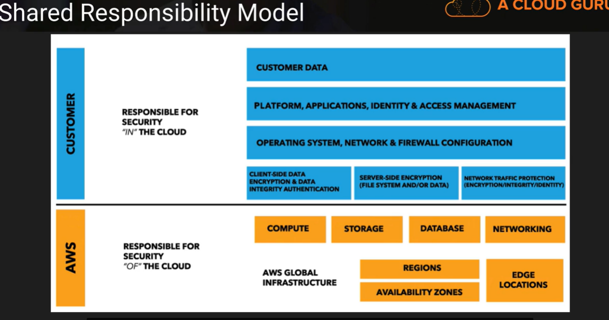

# **AWS Certified Security – Specialty (SCS-C01)**

# **Treinamentos**

## acloudguru✔

- https://learn.acloud.guru/course/aws-certified-security-specialty/overview

  

  

## AWS

https://aws.amazon.com/pt/certification/certified-security-specialty/

https://d1.awsstatic.com/training-and-certification/ramp-up_guides/Ramp-Up_Guide_Security.pdf

https://github.com/brunokktro/auladobruno#security-engineering-on-aws

https://explore.skillbuilder.aws/learn/course/internal/view/elearning/11612/exam-readiness-aws-certified-security-specialty-portuguese

https://explore.skillbuilder.aws/learn/course/internal/view/elearning/97/exam-readiness-aws-certified-security-specialty

https://explore.skillbuilder.aws/learn/course/internal/view/elearning/101/getting-started-with-aws-security-identity-and-compliance?ss=sec&sec=prep

https://explore.skillbuilder.aws/learn/course/internal/view/elearning/485/aws-foundations-securing-your-aws-cloud?trk=c750fe34-f44f-43e1-bcc0-6219228839b9&sc_channel=el

https://explore.skillbuilder.aws/learn/course/internal/view/elearning/101/getting-started-with-aws-security-identity-and-compliance?trk=c750fe34-f44f-43e1-bcc0-6219228839b9&sc_channel=el

https://explore.skillbuilder.aws/learn/course/internal/view/elearning/48/aws-security-fundamentals-second-edition?trk=c750fe34-f44f-43e1-bcc0-6219228839b9&sc_channel=el

https://explore.skillbuilder.aws/learn/course/internal/view/elearning/85/authentication-and-authorization-with-aws-identity-and-access-management?trk=c750fe34-f44f-43e1-bcc0-6219228839b9&sc_channel=el

https://explore.skillbuilder.aws/learn/course/internal/view/elearning/2045/aws-well-architected?trk=c750fe34-f44f-43e1-bcc0-6219228839b9&sc_channel=el

https://aws.amazon.com/training/classroom/aws-security-essentials/?trk=c750fe34-f44f-43e1-bcc0-6219228839b9&sc_channel=el

**AWS re:Inforce 2019: Best Practices for Choosing Identity Solutions for Applications (FND215)**

https://www.youtube.com/watch?v=-xTs4MmQOo4

**AWS re:Invent 2017: A Deep Dive into AWS Encryption Services (SID329)**

https://www.youtube.com/watch?v=gTZgxsCTfbk

**AWS re:Invent 2015 | (SEC201) How Should We All Think About Security?**

https://www.youtube.com/watch?v=fCH4r3s4THQ

**AWS re:Invent 2017: The AWS Philosophy of Security (SID322)**

https://www.youtube.com/watch?v=KJiCfPXOW-U

**AWS re:Invent 2019: [REPEAT 1] Getting started with AWS identity (SEC209-R1)**

https://www.youtube.com/watch?v=Zvz-qYYhvMk&list=PL2yQDdvlhXf9Ub-ekxAq0wMJpslV562SP&index=25

## vários

https://www.udemy.com/course/aws-certified-security-specialty/

https://learn.cantrill.io/

https://www.udemy.com/user/cybercorp/

https://www.udemy.com/course/aws-certified-security-specialty-exam/

https://www.udemy.com/course/aws-certified-security-specialty/

# **Documentação Oficial**

https://aws.amazon.com/pt/certification/certified-security-specialty/

## **Guia do Exame**

https://d1.awsstatic.com/training-and-certification/docs-security-spec/AWS-Certified-Security-Specialty_Exam-Guide.pdf

### **Domain 1: Incident Response** 

- **1.1 Given an AWS abuse notice, evaluate the suspected compromised instance or exposed access keys.** 
  - Given an AWS Abuse report about an EC2 instance, securely isolate the instance as part of a forensic investigation. 
  - Analyze logs relevant to a reported instance to verify a breach, and collect relevant data. 
  - Capture a memory dump from a suspected instance for later deep analysis or for legal compliance reasons. 
- **1.2 Verify that the Incident Response plan includes relevant AWS services.** 
  - Determine if changes to baseline security configuration have been made. 
  - Determine if list omits services, processes, or procedures which facilitate Incident Response. 
  - Recommend services, processes, procedures to remediate gaps. 
- **1.3 Evaluate the configuration of automated alerting, and execute possible remediation of securityrelated incidents and emerging issues.** 
  - Automate evaluation of conformance with rules for new/changed/removed resources. 
  - Apply rule-based alerts for common infrastructure misconfigurations. 
  - Review previous security incidents and recommend improvements to existing systems. 

### **Domain 2: Logging and Monitoring**

- **2.1 Design and implement security monitoring and alerting.** 
  
  - Analyze architecture and identify monitoring requirements and sources for monitoring statistics. 
  - Analyze architecture to determine which AWS services can be used to automate monitoring and alerting. 
  - Analyze the requirements for custom application monitoring, and determine how this could be achieved. 
  - Set up automated tools/scripts to perform regular audits.
  
- **2.2 Troubleshoot security monitoring and alerting.** 

  - Given an occurrence of a known event without the expected alerting, analyze the service functionality and configuration and remediate. 
  - Given an occurrence of a known event without the expected alerting, analyze the permissions and remediate.  Given a custom application which is not reporting its statistics, analyze the configuration and remediate. 
  - Review audit trails of system and user activity. 

  

- **2.3 Design and implement a logging solution.** 

  - Analyze architecture and identify logging requirements and sources for log ingestion. 
  - Analyze requirements and implement durable and secure log storage according to AWS best practices. 
  - Analyze architecture to determine which AWS services can be used to automate log ingestion and analysis. 2.4 Troubleshoot logging solutions. 
  - Given the absence of logs, determine the incorrect configuration and define remediation steps.
  -  Analyze logging access permissions to determine incorrect configuration and define remediation steps.
  -  Based on the security policy requirements, determine the correct log level, type, and sources. 

### **Domain 3: Infrastructure Security** 

- **3.1 Design edge security on AWS.** 

  - For a given workload, assess and limit the attack surface. 
  - Reduce blast radius (e.g. by distributing applications across accounts and regions). 
  - Choose appropriate AWS and/or third-party edge services such as WAF, CloudFront and Route 53 to protect against DDoS or filter application-level attacks. 
  - Given a set of edge protection requirements for an application, evaluate the mechanisms to prevent and detect intrusions for compliance and recommend required changes. 
  - Test WAF rules to ensure they block malicious traffic. 

  

- **3.2 Design and implement a secure network infrastructure.**

  -  Disable any unnecessary network ports and protocols. 
  - Given a set of edge protection requirements, evaluate the security groups and NACLs of an application for compliance and recommend required changes. 
  - Given security requirements, decide on network segmentation (e.g. security groups and NACLs) that allow the minimum ingress/egress access required. 
  - Determine the use case for VPN or Direct Connect. 
  - Determine the use case for enabling VPC Flow Logs.
  - Given a description of the network infrastructure for a VPC, analyze the use of subnets and gateways for secure operation. 

  

- **3.3 Troubleshoot a secure network infrastructure.** 

  - Determine where network traffic flow is being denied. 

  - Given a configuration, confirm security groups and NACLs have been implemented correctly.

    

- **3.4 Design and implement host-based security.** 
  
  - Given security requirements, install and configure host-based protections including Inspector, SSM. 
  - Decide when to use host-based firewall like iptables. 
  - Recommend methods for host hardening and monitoring. 

### **Domain 4: Identity and Access Management** 

- **4.1 Design and implement a scalable authorization and authentication system to access AWS resources.**

  - Given a description of a workload, analyze the access control configuration for AWS services and make recommendations that reduce risk.
  -  Given a description how an organization manages their AWS accounts, verify security of their root user. 
  - Given your organization’s compliance requirements, determine when to apply user policies and resource policies. 
  - Within an organization’s policy, determine when to federate a directory services to IAM. 
  - Design a scalable authorization model that includes users, groups, roles, and policies. 
  - Identify and restrict individual users of data and AWS resources. 
  - Review policies to establish that users/systems are restricted from performing functions beyond their responsibility, and also enforce proper separation of duties. 

  

- **4.2 Troubleshoot an authorization and authentication system to access AWS resources.** 

  - Investigate a user’s inability to access S3 bucket contents. 
  - Investigate a user’s inability to switch roles to a different account. 
  - Investigate an Amazon EC2 instance’s inability to access a given AWS resource. 

### **Domain 5: Data Protection** 

- **5.1 Design and implement key management and use.** 

  - Analyze a given scenario to determine an appropriate key management solution. 
  - Given a set of data protection requirements, evaluate key usage and recommend required changes. 
  - Determine and control the blast radius of a key compromise event and design a solution to contain the same. 

  

- **5.2 Troubleshoot key management.** 

  - Break down the difference between a KMS key grant and IAM policy.  Deduce the precedence given different conflicting policies for a given key. 
  - Determine when and how to revoke permissions for a user or service in the event of a compromise. 

  

- **5.3 Design and implement a data encryption solution for data at rest and data in transit.** 

  - Given a set of data protection requirements, evaluate the security of the data at rest in a workload and recommend required changes. 
  - Verify policy on a key such that it can only be used by specific AWS services. 
  - Distinguish the compliance state of data through tag-based data classifications and automate remediation. 
  - Evaluate a number of transport encryption techniques and select the appropriate method (i.e. TLS, IPsec, client-side KMS encryption

# **Workshops**

https://maturitymodel.security.aws.dev/en/

https://awsworkshop.io/

https://github.com/brunokktro/auladobruno#workshops--laborat%C3%B3rios

https://www.wellarchitectedlabs.com/security/?trk=c750fe34-f44f-43e1-bcc0-6219228839b9&sc_channel=el

https://awssecworkshops.com/workshops/?trk=c750fe34-f44f-43e1-bcc0-6219228839b9&sc_channel=el

https://catalog.us-east-1.prod.workshops.aws/workshops/c2f03000-cf61-42a6-8e62-9eaf04907417/en-US/

# **Simulados**

Whizlabs

https://www.udemy.com/user/tutorials-dojo-3/

# **Links** 

**AWS Certified Security – Speciality (SCS-C01) Exam Learning Path**

https://jayendrapatil.com/aws-certified-security-speciality-scs-c01-exam-learning-path/

# Estudos

## **Security OF AWS**

### **Shared Responsability Model**

## **Security IN AWS**

### AWS Config
