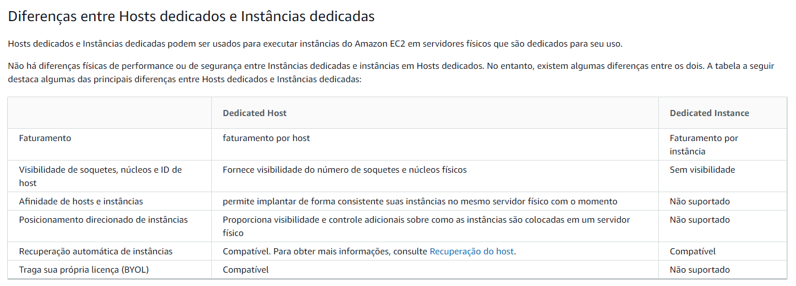

# **AWS Certified Security – Specialty (SCS-C01)**

https://aws.amazon.com/pt/certification/certified-security-specialty/


# **Treinamentos**


## AWS

https://aws.amazon.com/pt/certification/certified-security-specialty/✔

https://d1.awsstatic.com/training-and-certification/ramp-up_guides/Ramp-Up_Guide_Security.pdf✔

https://explore.skillbuilder.aws/learn/course/internal/view/elearning/101/getting-started-with-aws-security-identity-and-compliance?ss=sec&sec=prep

https://explore.skillbuilder.aws/learn/course/internal/view/elearning/485/aws-foundations-securing-your-aws-cloud?trk=c750fe34-f44f-43e1-bcc0-6219228839b9&sc_channel=el

https://explore.skillbuilder.aws/learn/course/internal/view/elearning/101/getting-started-with-aws-security-identity-and-compliance?trk=c750fe34-f44f-43e1-bcc0-6219228839b9&sc_channel=el

https://explore.skillbuilder.aws/learn/course/internal/view/elearning/48/aws-security-fundamentals-second-edition?trk=c750fe34-f44f-43e1-bcc0-6219228839b9&sc_channel=el

https://explore.skillbuilder.aws/learn/course/internal/view/elearning/85/authentication-and-authorization-with-aws-identity-and-access-management?trk=c750fe34-f44f-43e1-bcc0-6219228839b9&sc_channel=el

https://explore.skillbuilder.aws/learn/course/internal/view/elearning/2045/aws-well-architected?trk=c750fe34-f44f-43e1-bcc0-6219228839b9&sc_channel=el

https://aws.amazon.com/training/classroom/aws-security-essentials/?trk=c750fe34-f44f-43e1-bcc0-6219228839b9&sc_channel=el

https://github.com/brunokktro/auladobruno#security-engineering-on-aws

https://explore.skillbuilder.aws/learn/course/internal/view/elearning/11612/exam-readiness-aws-certified-security-specialty-portuguese

https://explore.skillbuilder.aws/learn/course/internal/view/elearning/97/exam-readiness-aws-certified-security-specialty

https://aws.amazon.com/pt/blogs/aws-brasil/dicas-para-a-certificacao-de-especialista-em-seguranca-na-aws/

https://aws.amazon.com/training/learn-about/security/

https://www.youtube.com/watch?v=QMBkq6MrT2w&list=PLWY0DzS7zQeMPwpQvke2j94sxgFI2o3NM

https://www.youtube.com/watch?v=BDeCVOpCsVo


**AWS re:Inforce 2019: Best Practices for Choosing Identity Solutions for Applications (FND215)**

https://www.youtube.com/watch?v=-xTs4MmQOo4


**AWS re:Invent 2017: A Deep Dive into AWS Encryption Services (SID329)**

https://www.youtube.com/watch?v=gTZgxsCTfbk


**AWS re:Invent 2015 | (SEC201) How Should We All Think About Security?**

https://www.youtube.com/watch?v=fCH4r3s4THQ


**AWS re:Invent 2017: The AWS Philosophy of Security (SID322)**

https://www.youtube.com/watch?v=KJiCfPXOW-U


https://www.youtube.com/watch?v=9Nikqn_02Oc


**AWS re:Invent 2019: [REPEAT 1] Getting started with AWS identity (SEC209-R1)**

https://www.youtube.com/watch?v=Zvz-qYYhvMk&list=PL2yQDdvlhXf9Ub-ekxAq0wMJpslV562SP&index=25


## acloudguru

- https://learn.acloud.guru/course/aws-certified-security-specialty/overview


## Dojo

https://portal.tutorialsdojo.com/courses/exam-readiness-aws-certified-security-specialty-scs-c01/


## vários

https://www.udemy.com/course/aws-certified-security-specialty/

https://www.youtube.com/watch?v=QMBkq6MrT2w&list=PLWY0DzS7zQeMPwpQvke2j94sxgFI2o3NM

https://www.youtube.com/watch?v=HnoZS5jj7pk

https://www.youtube.com/watch?v=kIZIkUnF3ow

https://www.whizlabs.com/aws-certified-security-specialty/

https://www.youtube.com/watch?v=VjVpqC0o4oQ&list=PLeLcvrwLe184Q24ljho5Md3Z38VY0keNt

https://maturitymodel.security.aws.dev/en/

http://dfr20cpm485ln.cloudfront.net/SecEng_HLS_index.html

https://learn.cantrill.io/

https://www.udemy.com/user/cybercorp/

https://www.udemy.com/course/aws-certified-security-specialty-exam/

https://www.udemy.com/course/aws-certified-security-specialty/

https://www.youtube.com/watch?v=VjVpqC0o4oQ&list=PLeLcvrwLe184Q24ljho5Md3Z38VY0keNt


# **Documentação Oficial**

https://aws.amazon.com/pt/certification/certified-security-specialty/


## **Guia do Exame**

https://d1.awsstatic.com/training-and-certification/docs-security-spec/AWS-Certified-Security-Specialty_Exam-Guide.pdf


### **Domain 1: Incident Response** 

- **1.1 Given an AWS abuse notice, evaluate the suspected compromised instance or exposed access keys.** 
  - Given an AWS Abuse report about an EC2 instance, securely isolate the instance as part of a forensic investigation. 
  - Analyze logs relevant to a reported instance to verify a breach, and collect relevant data. 
  - Capture a memory dump from a suspected instance for later deep analysis or for legal compliance reasons. 
- **1.2 Verify that the Incident Response plan includes relevant AWS services.** 
  - Determine if changes to baseline security configuration have been made. 
  - Determine if list omits services, processes, or procedures which facilitate Incident Response. 
  - Recommend services, processes, procedures to remediate gaps. 
- **1.3 Evaluate the configuration of automated alerting, and execute possible remediation of securityrelated incidents and emerging issues.** 
  - Automate evaluation of conformance with rules for new/changed/removed resources. 
  - Apply rule-based alerts for common infrastructure misconfigurations. 
  - Review previous security incidents and recommend improvements to existing systems. 


### **Domain 2: Logging and Monitoring**

- **2.1 Design and implement security monitoring and alerting.** 
  
  - Analyze architecture and identify monitoring requirements and sources for monitoring statistics. 
  - Analyze architecture to determine which AWS services can be used to automate monitoring and alerting. 
  - Analyze the requirements for custom application monitoring, and determine how this could be achieved. 
  - Set up automated tools/scripts to perform regular audits.
  
- **2.2 Troubleshoot security monitoring and alerting.** 

  - Given an occurrence of a known event without the expected alerting, analyze the service functionality and configuration and remediate. 
  - Given an occurrence of a known event without the expected alerting, analyze the permissions and remediate.  Given a custom application which is not reporting its statistics, analyze the configuration and remediate. 
  - Review audit trails of system and user activity. 

  

- **2.3 Design and implement a logging solution.** 

  - Analyze architecture and identify logging requirements and sources for log ingestion. 
  - Analyze requirements and implement durable and secure log storage according to AWS best practices. 
  - Analyze architecture to determine which AWS services can be used to automate log ingestion and analysis. 2.4 Troubleshoot logging solutions. 
  - Given the absence of logs, determine the incorrect configuration and define remediation steps.
  -  Analyze logging access permissions to determine incorrect configuration and define remediation steps.
  -  Based on the security policy requirements, determine the correct log level, type, and sources. 


### **Domain 3: Infrastructure Security** 

- **3.1 Design edge security on AWS.** 

  - For a given workload, assess and limit the attack surface. 
  - Reduce blast radius (e.g. by distributing applications across accounts and regions). 
  - Choose appropriate AWS and/or third-party edge services such as WAF, CloudFront and Route 53 to protect against DDoS or filter application-level attacks. 
  - Given a set of edge protection requirements for an application, evaluate the mechanisms to prevent and detect intrusions for compliance and recommend required changes. 
  - Test WAF rules to ensure they block malicious traffic. 

  

- **3.2 Design and implement a secure network infrastructure.**

  -  Disable any unnecessary network ports and protocols. 
  - Given a set of edge protection requirements, evaluate the security groups and NACLs of an application for compliance and recommend required changes. 
  - Given security requirements, decide on network segmentation (e.g. security groups and NACLs) that allow the minimum ingress/egress access required. 
  - Determine the use case for VPN or Direct Connect. 
  - Determine the use case for enabling VPC Flow Logs.
  - Given a description of the network infrastructure for a VPC, analyze the use of subnets and gateways for secure operation. 

  

- **3.3 Troubleshoot a secure network infrastructure.** 

  - Determine where network traffic flow is being denied. 

  - Given a configuration, confirm security groups and NACLs have been implemented correctly.

    

- **3.4 Design and implement host-based security.** 
  
  - Given security requirements, install and configure host-based protections including Inspector, SSM. 
  - Decide when to use host-based firewall like iptables. 
  - Recommend methods for host hardening and monitoring. 


### **Domain 4: Identity and Access Management** 


- **4.1 Design and implement a scalable authorization and authentication system to access AWS resources.**

  - Given a description of a workload, analyze the access control configuration for AWS services and make recommendations that reduce risk.
  -  Given a description how an organization manages their AWS accounts, verify security of their root user. 
  - Given your organization’s compliance requirements, determine when to apply user policies and resource policies. 
  - Within an organization’s policy, determine when to federate a directory services to IAM. 
  - Design a scalable authorization model that includes users, groups, roles, and policies. 
  - Identify and restrict individual users of data and AWS resources. 
  - Review policies to establish that users/systems are restricted from performing functions beyond their responsibility, and also enforce proper separation of duties. 

  

- **4.2 Troubleshoot an authorization and authentication system to access AWS resources.** 

  - Investigate a user’s inability to access S3 bucket contents. 
  - Investigate a user’s inability to switch roles to a different account. 
  - Investigate an Amazon EC2 instance’s inability to access a given AWS resource. 


### **Domain 5: Data Protection** 


- **5.1 Design and implement key management and use.** 

  - Analyze a given scenario to determine an appropriate key management solution. 
  - Given a set of data protection requirements, evaluate key usage and recommend required changes. 
  - Determine and control the blast radius of a key compromise event and design a solution to contain the same. 

  

- **5.2 Troubleshoot key management.** 

  - Break down the difference between a KMS key grant and IAM policy.  Deduce the precedence given different conflicting policies for a given key. 
  - Determine when and how to revoke permissions for a user or service in the event of a compromise. 

  

- **5.3 Design and implement a data encryption solution for data at rest and data in transit.** 

  - Given a set of data protection requirements, evaluate the security of the data at rest in a workload and recommend required changes. 
  - Verify policy on a key such that it can only be used by specific AWS services. 
  - Distinguish the compliance state of data through tag-based data classifications and automate remediation. 
  - Evaluate a number of transport encryption techniques and select the appropriate method (i.e. TLS, IPsec, client-side KMS encryption


# **Workshops**

https://maturitymodel.security.aws.dev/en/

https://awsworkshop.io/

https://github.com/brunokktro/auladobruno#workshops--laborat%C3%B3rios

https://www.wellarchitectedlabs.com/security/?trk=c750fe34-f44f-43e1-bcc0-6219228839b9&sc_channel=el

https://awssecworkshops.com/workshops/?trk=c750fe34-f44f-43e1-bcc0-6219228839b9&sc_channel=el

https://catalog.us-east-1.prod.workshops.aws/workshops/c2f03000-cf61-42a6-8e62-9eaf04907417/en-US/


# **Simulados**

Whizlabs

https://www.udemy.com/user/tutorials-dojo-3/


# **Links** 

**AWS Certified Security – Speciality (SCS-C01) Exam Learning Path**

https://jayendrapatil.com/aws-certified-security-speciality-scs-c01-exam-learning-path/


**Top 10 security items to improve in your AWS account**

https://aws.amazon.com/blogs/security/top-10-security-items-to-improve-in-your-aws-account/


# Studies


## Services


### **EC2 (Elastic Compute Cloud)**

- Serviço que vc tem controle total

- **EC2 Instance Connect**

  - Connecta na EC2 via console AWS

- **EC2 UserData**

  - bootstrap
  - executa no primeiro boot

- **SO**

  - Linux, Windows e MAcOS

- **Benefícios da EC2**

  - Elasticidade, Flexível
  - Integração com demais serviços
  - Confiável
  - Seguro
  - Baixo Custo

- **Tipos de Instâncias**

  https://aws.amazon.com/pt/ec2/instance-types/

  - **General Purpose**

    - Instâncias de uso geral fornecem um equilíbrio de recursos de computação, memória e rede e podem ser usadas para diversas cargas de trabalho.

  - **Compute Optimized**

    - As instâncias otimizadas para computação são ideais para aplicativos vinculados a computação que se beneficiam de processadores de alto desempenho.
      - Batch
      - Media
      - HPC
      - Machine Learning

  - **Memory Optimized**

    - As instâncias otimizadas de memória são projetadas para fornecer desempenho rápido para cargas de trabalho que processam grandes conjuntos de dados na memória.

  - **Accelerated Computing**

    - Instâncias de computação aceleradas usam aceleradores de hardware, ou coprocessadores, para executar funções, como cálculos de número de ponto flutuante, processamento de gráficos ou correspondência de padrões de dados, mais eficientemente do que é possível no software em execução nas CPUs.

  - **Storage Optimized**

    - As instâncias otimizadas para armazenamento são projetadas para cargas de trabalho que exigem acesso de leitura e gravação sequencial alto a conjuntos de dados muito grandes no armazenamento local. Elas

  - **Instances Features**

  - **Measuring Instance Performance**

    

- **EC2 Dedicated Hosts**

  https://docs.aws.amazon.com/AWSEC2/latest/UserGuide/dedicated-hosts-overview.html

  https://aws.amazon.com/pt/ec2/dedicated-hosts/

  - Podem utilizar licenças de software existentes no cliente - BYOL

  - Tudo no mesmo servidor, deploys

    

- **EC2 Dedicated Instances**

  https://aws.amazon.com/pt/ec2/pricing/dedicated-instances/

  - Roda em hardware dedicado mas vc não tem acesso

    

- **EC2 Dedicated Instances vs EC2 Dedicated Hosts**



- **Preços**

  - **Sob-Demanda**

    **https://aws.amazon.com/blogs/aws/new-per-second-billing-for-ec2-instances-and-ebs-volumes/**

    - **Por hora ou por segundo**
    - **60 segundos é a cobrança mínima**

  - **Saving Plans**

    - 1 ou 3 anos
    - **Até 72% de desconto comparado ao sob-demanda**
    - **EC2 Saving Plans**
      - **Até 72% de descontos**
      - Individual instances
    - **Compute Saving Plans**
      - Mais flexível
      - EC2, Fargate e Lambda

  - **Instâncias Reservadas**

    - 1 ou 3 Anos
    - Standard, Convertable ou Scheduled

  - **Instâncias Spot**

    https://aws.amazon.com/ec2/spot/

    - Aviso de até **2 minutos**
    - **Até 90% de desconto comparado ao sob-demanda**
    - Cargas de trabalhos em lote


### **AWS Hypervisor**

https://aws.amazon.com/pt/ec2/nitro/

VMM


### **Elastic Block Store (EBS)**

https://aws.amazon.com/pt/ebs/

- Armazenamento a nível de bloco

- Independente da vida útil da instância

- **Snapshots são armazenados de forma incremental, é cobrado pelos blocos alterados armazenados**

- É **automaticamente replicado** entre AZ´s

- **Mas é armazenado em uma única AZ**

- É cobrado pelo Tipo e pelo IOPS provisionado.

- Snapshot point-in-time

- Snapshots podem ser copiados entre Regiões

- Memory scrubbing

  https://d1.awsstatic.com/whitepapers/Security/Security_Compute_Services_Whitepaper.pdf

- Ate 16 TiB

- **Pode ser anexado a uma única instância na mesma Zona de disponibilidade**

- Flag - Delete on Termination

  - Para deletar o EBS quando deleta a EC2
  - Não vem ativado por default

  

### AWS Identity ans Access Management (IAM)

https://docs.aws.amazon.com/iam/index.html


#### Summary

- Controle de acesso para recursos
- MFA
  - Virtual MFA Devices (Google Autenticator or Authy)
  - Universal 2nd Factor (U2F) Security Key - **Phisical Device**
  - Hardware Key Fob MFA Device
  - Hardware Key Fob MFA Device for AWS GovCloud (US)
- **Serviço Global**
- Analise de acesso
- Por padrão um usuário não tem permissões - **tudo negado por default**


#### IAM Users

- **Users**
  - Podemos ter um usuário em mais de um grupo


#### IAM Policies

https://docs.aws.amazon.com/pt_br/IAM/latest/UserGuide/access_policies.html

- json

- **3 tipos de policies**

  - **AWS Managed Policies**

    - Políticas gerenciadas que são criadas e gerenciadas pela AWS.

    - Você pode alterar

      

  - **Customer Managed Policies**

    - Políticas gerenciadas que você criar e gerenciar em sua conta da AWS. 

    - As políticas gerenciadas pelo cliente oferecem um controle mais preciso de suas políticas do que as políticas gerenciadas pela AWS.

      

  - **Inline Policies**

    - Políticas adicionadas diretamente a um único usuário, grupo ou função. 

    - As políticas em linha mantêm um relacionamento estrito de um para um entre uma política e uma identidade. 

    - Elas são excluídas quando você exclui a identidade.

      

- Estrutura de uma Policy

  

  

**Simple Policy**


#### IAM Roles

- Identidades que podem assumir
- Assumidas temporária
- Permissões associadas
- Não podem ser utilizadas por usuários, somente por **AWS Services**


#### IAM Groups

- Agrupamentos de usuários com permissões em comum

- Grupos só tem usuários e não pode ter outros Grupos

  


#### **Security Tools**

- **IAM Credentials Report (account-level)**

  - Report que lista todos os usuários de sua conta e o status de suas várias credenciais

  - É armazenado por até quatro horas

  - Não é usado para revisar as permissões concedidas a um usuário.

    

- **IAM Access Advisor (user-level)**

  - Mostra os serviços que este usuário pode acessar e quando esses serviços foram acessados pela última vez
  - Lista atividades de ate 4 horas
  - Você pode identificar permissões desnecessárias para que possa revisar suas políticas de IAM de acordo


#### Best Practices

https://docs.aws.amazon.com/IAM/latest/UserGuide/best-practices.html


#### IAM Authorization


#### IAM Authentication


#### **IAM Credential Report**

https://docs.aws.amazon.com/pt_br/IAM/latest/UserGuide/id_credentials_getting-report.html

- Report que lista todos os **usuários** de sua conta e o status de suas várias credenciais
- É armazenado por até quatro horas
- Não é usado para revisar as permissões concedidas a um usuário.
- **Usuários, Passwords, Access Keys, MFA**
- Exemplo


##### **Obter relatórios de credenciais (AWS CLI)**

**Para fazer download um relatório de credenciais (AWS CLI)**

1. Gere um relatório de credenciais. O AWS armazena um único relatório. Se um relatório existir, a geração de um relatório de credenciais substituirá o relatório anterior. [`aws iam generate-credential-report`](https://docs.aws.amazon.com/cli/latest/reference/iam/generate-credential-report.html)
2. Exibir o último relatório gerado: [`aws iam get-credential-report`](https://docs.aws.amazon.com/cli/latest/reference/iam/get-credential-report.html)


##### **Obter relatórios de credenciais (API da AWS)**

**Para fazer download de um relatório de credenciais (API AWS)**

1. Gere um relatório de credenciais. O AWS armazena um único relatório. Se um relatório existir, a geração de um relatório de credenciais substituirá o relatório anterior. [`GenerateCredentialReport`](https://docs.aws.amazon.com/IAM/latest/APIReference/API_GenerateCredentialReport.html)
2. Exibir o último relatório gerado: [`GetCredentialReport`](https://docs.aws.amazon.com/IAM/latest/APIReference/API_GetCredentialReport.html)


##### **Permissões necessárias**

p/ criar - generatecredentialreport

p/ download - getcredentialreport


### Amazon Cognito

https://aws.amazon.com/cognito/

- Federação de Identidade

  - Web Facebook, Google

  - Mobile

    


#### User Identity


#### Cognito User Pools

https://docs.aws.amazon.com/pt_br/cognito/latest/developerguide/cognito-user-identity-pools.html

https://aws.amazon.com/premiumsupport/knowledge-center/cognito-user-pools-identity-pools/

https://tutorialsdojo.com/amazon-cognito-user-pools-and-identity-pools-explained/

**São utilizados para autenticação.**

User Pools é um diretório de usuários no Amazon Cognito. Com um grupo de usuários, seus usuários podem fazer login em aplicações Web ou móveis por meio do Amazon Cognito. 

Os usuários também podem fazer login por meio de provedores de identidade social, como o Google, o Facebook, a Amazon ou a Apple, e por meio de provedores de identidade SAML. 

Quer os usuários façam login diretamente ou por meio de terceiros, todos os membros do grupo de usuários têm um perfil de diretório que você pode acessar por meio de um Kit de desenvolvimento de software (SDK).

Os grupos de usuários fornecem:

- Serviços de cadastro e login.
- Uma interface do usuário da web integrada e personalizável para login de usuários.
- Login social com Facebook, Google, Login with Amazon e Iniciar sessão com a Apple, além de login com provedores de identidade SAML a partir do seu grupo de usuários.
- Gerenciamento de diretório de usuários e perfis de usuário.
- Recursos de segurança como a autenticação multifator (MFA) verifica a existência de credenciais comprometidas, proteção de aquisição de conta e verificação de e-mail e telefone.
- Fluxos de trabalho personalizados e migração de usuários por meio de triggers do AWS Lambda.

Após autenticar com êxito um usuário, o Amazon Cognito emite JSON Web Tokens (JWT) que você pode usar para proteger e autorizar o acesso às suas próprias APIs ou trocar por credenciais da AWS.


1. Os usuários enviam solicitações de autenticação para os User Pool do Cognito. 

2. O  User Pool do Cognito verifica a identidade do usuário ou envia a solicitação para Identity Providers, como Facebook, Google, Amazon ou autenticação SAML (com Microsoft AD).

3. O token do  User Pool do Cognito é enviado de volta ao usuário. 

4. A pessoa pode usar esse token para acessar suas APIs de back-end hospedadas em seus clusters do EC2 ou no API Gateway e Lambda.

   

**Casos de uso**

- [Crie páginas da Web de inscrição e login para seu aplicativo](https://aws.amazon.com/premiumsupport/knowledge-center/cognito-hosted-web-ui/) .
- [Acesse e gerencie os dados do usuário](https://docs.aws.amazon.com/cognito/latest/developerguide/user-pool-settings-attributes.html) .
- Rastreie o dispositivo, a localização e o endereço IP do usuário e [adapte-se às solicitações de entrada de diferentes níveis de risco](https://docs.aws.amazon.com/cognito/latest/developerguide/cognito-user-pool-settings-adaptive-authentication.html) .
- Use um [fluxo de autenticação personalizado](https://docs.aws.amazon.com/cognito/latest/developerguide/amazon-cognito-user-pools-authentication-flow.html#amazon-cognito-user-pools-custom-authentication-flow) para seu aplicativo.


#### **Cognito Identity Pools**

https://docs.aws.amazon.com/pt_br/cognito/latest/developerguide/identity-pools.html

**São utilizados para autorização.**

Identity Pools do Amazon Cognito fornecem credenciais temporárias da AWS para usuários que são convidados (não autenticados) e para usuários que foram autenticados e receberam um token.

 Um Identity Pools é um repositório de dados de identidade de usuários específicos para sua conta.

**Casos de uso**

- Dê a seus usuários [acesso a recursos da AWS](https://docs.aws.amazon.com/cognito/latest/developerguide/iam-roles.html) , como um bucket do Amazon Simple Storage Service (Amazon S3) ou uma tabela do Amazon DynamoDB.
- Gere [credenciais temporárias da AWS para usuários não autenticados](https://docs.aws.amazon.com/cognito/latest/developerguide/switching-identities.html) .


1. O aplicativo Web ou aplicativo móvel envia seu token de autenticação para Cognito Identity Pools. O token pode vir de um provedor de identidade válido, como Cognito User Pools, Amazon ou Facebook. 
2. O Cognito Identity Pool troca o token de autenticação do usuário por credenciais temporárias da AWS para acessar recursos como S3 ou DynamoDB. As credenciais da AWS são enviadas de volta ao usuário. 
3. As credenciais temporárias da AWS serão usadas para acessar os recursos da AWS. 


#### Federetion with User Pools


#### **Web Identity Federation**


### AWS Directory Service

https://docs.aws.amazon.com/directoryservice/latest/admin-guide/what_is.html

O AWS Directory Service oferece várias maneiras de usar o Microsoft Active Directory (AD) com outros serviços da AWS. Os diretórios armazenam informações sobre usuários, grupos e dispositivos, e os administradores os usam para gerenciar o acesso a informações e recursos.


#### AWS Managed Microsoft AD

https://docs.aws.amazon.com/directoryservice/latest/admin-guide/ms_ad_use_cases.html

Também conhecido como AWS Managed Microsoft AD, o AWS Directory Service for Microsoft Active Directory é desenvolvido por um Microsoft Windows Server Active Directory (AD) real, gerenciado pela AWS na Nuvem AWS. Ele permite que você migre uma ampla variedade de aplicativos com reconhecimento do Active Directory para a Nuvem AWS. 


#### Active Directory Connector

O AD Connector é um serviço de proxy que oferece uma maneira fácil de conectar aplicativos compatíveis da AWS, como Amazon WorkSpaces, Amazon QuickSight e [Amazon EC2](https://aws.amazon.com/ec2/)para instâncias do Windows Server, para o Microsoft Active Directory local existente. Com o AD Connector, você pode simplesmente [adicionar uma conta de serviço](https://docs.aws.amazon.com/directoryservice/latest/admin-guide/prereq_connector.html#connect_delegate_privileges) ao seu Active Directory. O AD Connector também elimina a necessidade de sincronização de diretórios ou o custo e a complexidade de hospedar uma infraestrutura de federação.


#### Simple Active Directory

*O Simple AD é um diretório compatível* com o Microsoft Active Directory do AWS Directory Service que é desenvolvido pelo Samba 4. O Simple AD oferece suporte a recursos básicos do Active Directory, como contas de usuário, associações a grupos, ingresso em um domínio Linux ou instâncias EC2 baseadas em Windows, SSO baseado em Kerberos e políticas de grupo. A AWS fornece monitoramento, instantâneos diários e recuperação como parte do serviço.


### AWS Single Sign-On

- **Summary**

  - SAML 2.0
  - Login em múltiplas contas

- **Integrado com**

  - AD On Premises

  - AWS Organizations

  - Business app - Dropbox, Slack, Office 365

  - Custom App

    

### **AWS Trusted Advisor**

https://aws.amazon.com/pt/premiumsupport/technology/trusted-advisor/

- Checar os softlimits

- Não é usado para obter **insights operacionais**

- **Recomendações de Segurança e Otimização de custos**

- Para receber notificações deve-se configura-ls na console

- 5 categorias

  - *Cost Optimization*
  - *Performance*
  - *Secutiry*
  - *Fault Tolerance*
  - *Service Limits*

- Algumas verificações são gratuitas

- Checks de acordo com Plano de Suportes

  - **Basic e Developer Supports Plan**

    - S3 Bucket
    - Security Group
    - IAM use
    - MFA
    - EBS Public Snapshot
    - RDS Public Snapshot
    - Service Limits

  - **Business e Enterprise Supports Plan**

    - Full checks

    - Pode habilitar o CloudWatch Alarm

    - AWS Support API

      

### **AWS Inspector**

https://aws.amazon.com/pt/inspector/

https://docs.aws.amazon.com/inspector/v1/userguide/inspector_cis.html

- É um serviço automatizado de avaliação de segurança que ajuda a melhorar a segurança e a conformidade dos aplicativos implantados na AWS.
- Ele ajuda a testar a acessibilidade de rede de suas instâncias do Amazon EC2 e o estado de segurança de seus aplicativos em execução nas instâncias.
- Realiza verificações nas **instâncias EC2** em relação a modelos de segurança
- Severity Level
  - *High*
  - *Medium*
  - *Low*
  - *Informational*
- Analisa vulnerabilidades
- **Agente AWS na EC2**
  - https://docs.aws.amazon.com/inspector/v1/userguide/inspector_installing-uninstalling-agents.html
- 2 tipos de assessments
  - Network Assessments
    - Agent opcional
  - Host Assessments 
    - Precisa de agents


### AWS CloudHSM 

**(Hardware Security Module – Módulo de segurança de hardware)** 

https://aws.amazon.com/pt/cloudhsm/

O AWS CloudHSM é baseado na nuvem que permite gerar e usar facilmente suas próprias chaves de criptografia na Nuvem AWS. 

Com o CloudHSM, você pode gerenciar suas próprias chaves de criptografia usando HSMs validados pelo FIPS 140-2 nível 3 e EAL-4

O CloudHSM oferece a flexibilidade de integrar-se aos seus aplicativos usando APIs padrão do setor, como bibliotecas Microsoft CryptoNG (CNG), PKCS#11 e Java Cryptography Extensions (JCE).

- **AWS não tem acesso as suas keys**


### **AWS Config**

https://aws.amazon.com/pt/config/

https://aws.amazon.com/pt/config/faq/

É um serviço que permite acessar, auditar e avaliar as configurações dos recursos da AWS.

#### **Summary**

- Controla as alterações de configuração nos recursos
- É um serviço que permite que você avalie, audite e avalie as configurações de seus recursos da AWS.
- Grava todas as alterações no recurso
- Pode salvar os dados no S3 e analisar pelo Athena
- Publish for SNS


#### **Conformance Packs**

https://docs.aws.amazon.com/pt_br/config/latest/developerguide/conformance-packs.html

É uma coleção de regras do AWS Config e ações de correção que podem ser facilmente implantadas como uma única entidade em uma conta e em uma região, ou em uma organização no AWS Organizations.

Os pacotes de conformidade são criados usando um modelo YAML criado por você que contenha a lista de regras gerenciadas ou personalizadas do AWS Config e as ações de correção. É possível implantar o modelo usando o console do AWS Config ou a AWS CLI. Para começar rapidamente e avaliar o ambiente da AWS, use um dos modelos do pacote de conformidade de exemplo.


#### **Aggegator**

https://docs.aws.amazon.com/pt_br/config/latest/developerguide/aggregate-data.html


#### **AWS Config Rules**

**Only Admins**

- ##### **AWS Managed Rules**

  - basic
  - https://docs.aws.amazon.com/pt_br/config/latest/developerguide/evaluate-config_use-managed-rules.html

- ##### **Customer managed Rules**

  - https://docs.aws.amazon.com/pt_br/config/latest/developerguide/evaluate-config_develop-rules.html


### AWS CloudWatch

https://aws.amazon.com/pt/cloudwatch/

https://aws.amazon.com/cloudwatch/faqs/

O Amazon CloudWatch é um serviço de monitoramento e observabilidade criado para engenheiros de DevOps, desenvolvedores, engenheiros de confiabilidade de sites (SREs), gerentes de TI e proprietários de produtos.

- **Summary**
  - Coleta métricas e Logs
  - Coleta On-premisse
  - Real Time
  - Custom metrics
  - Notificações
  - Alarmes
  - Métricas


#### **CloudWatch Events**

https://docs.aws.amazon.com/pt_br/AmazonCloudWatch/latest/events/WhatIsCloudWatchEvents.html

- Cron Jobs
- Schedule
- Event Pattern
- Trigger


#### CloudWatch Logs

https://docs.aws.amazon.com/pt_br/AmazonCloudWatch/latest/logs/WhatIsCloudWatchLogs.html

- Real-Time Monitoring

- Inclui CloudTrail

- **Coleta On-premisse através de agent**

- Ajust Retention

- Logs From

  - ECS, Lambda, Cloudtrail, Cloudwatch agent, Beanstalk, Route53

    

#### CloudWatch Alarms

https://docs.aws.amazon.com/pt_br/AmazonCloudWatch/latest/monitoring/AlarmThatSendsEmail.html

- Actions

  - Auto Scaling
  - EC2
  - SNS

- Utilizado como trigger

- Alarm State

  - OK

  - INSUFFICIENT_DATA

  - ALARM

    

#### CloudWatch Metrics

https://docs.aws.amazon.com/pt_br/AmazonCloudWatch/latest/monitoring/working_with_metrics.html

- Timestamps
- Dashboards
- Não tem métricas de RAM para EC2
- Default 5 minutes
- Detailed Monitoring - 1 min
- Custom Metrics


### **EventBridge**

- Summary
  - Custom Event buses
  - Schema registry

## 


### AWS Security Hub

https://aws.amazon.com/security-hub/?c=sc&sec=srv&aws-security-hub-blogs.sort-by=item.additionalFields.createdDate&aws-security-hub-blogs.sort-order=desc


### **AWS Organizations**

https://aws.amazon.com/pt/organizations/


- **Summary**
  - Global Service
  - Para automatizar a criação de AWS Accounts
  - Gerenciamento centralizado de todas as contas
  - Agrupamento - OU
  - Controle de serviços/API por conta
  - Habilita CloudTrail em todas as contas para enviar os Log´s para um Bucket S3 central
  - Envia todos os CloudWatch Logs para uma conta central
  - **Para remover uma conta, a conta AWS deve ser capaz de operar como uma conta autônoma. Só então ele pode ser removido das organizações AWS**
- **Consolidated Billing**
  - Descontos
    - Volume
    - Reserved Instances
      - **Só recebe os descontos se as EC2 estiverem na mesma AZ**
    - Saving Plans
  - Uma invoice
- **Service Control Polices (SCP)**
  - Política da organização que você pode usar para gerenciar permissões em sua organização.
  - Um SCP abrange todos os usuários, grupos e funções do IAM, incluindo o usuário raiz da conta da AWS.
  - Whitelist e Black List
  - Apply OU ou Account level
  - Não é aplicado na conta Master
  - Aplica em todos os usuários e roles, incluindo o root
  - Deve ter a permissão **Explicito**


### **AWS Security Token Service (STS)**

https://docs.aws.amazon.com/pt_br/IAM/latest/UserGuide/id_credentials_temp_enable-regions.html


Acesso limitado e temporario a recursos da AWS.

- Federetion (typically Active Directory)
  - use SALM
- Federetion with Mobile Apps
- Cross Account Access
- Key Terms
  - Federation
  - Identity Broker
  - Identity Store - Serviços como AD, Facebook, Google e etc.
  - Indentities


### AWS GuardDuty

https://aws.amazon.com/pt/guardduty/

- Detecção de ameaças

- **DNS Logs, Flow Logs e Cloudtrail Logs**

- Usa Machine Learning

  

### **Amazon Inspector**

- É um serviço automatizado de avaliação de segurança que ajuda a melhorar a segurança e a conformidade dos aplicativos implantados na AWS.

- Ele ajuda a testar a acessibilidade de rede de suas instâncias do Amazon EC2 e o estado de segurança de seus aplicativos em execução nas instâncias.

- Realiza verificações nas **instâncias EC2** em relação a modelos de segurança

- Analisa vulnerabilidades

- **Agente AWS na EC2**

  

### Amazon Detective

https://docs.aws.amazon.com/detective/latest/adminguide/what-is-detective.html

- Torna mais fácil analisar, investigar e identificar rapidamente a **causa raiz** de possíveis problemas de segurança ou atividades suspeitas.

- Serviço persistente orientado a **Machine Learning**

- Analisa, investiga e mstra a causa raiz do problema

- Coleta automático

  - Cloudtaul

  - Guardduty

  - VPC Flow Logs

    

### Amazon Macie

- Usa machine learning
- Analisa dados no S3
- PII data
- Dados sensíveis


### **Secrets Manager**

- Rotação de secrets

- Integra com RDS

- criptografia com KMS

  


### AWS CloudTrail

https://aws.amazon.com/pt/cloudtrail/

O AWS CloudTrail monitora e registra a atividade da conta por toda a infraestrutura da AWS, oferecendo controle sobre o armazenamento, análise e ações de remediação. Rastreie atividades dos usuários e uso de APIs.

#### **Summary**

- Auditoria de API

- Salva log´s em **Bucket S3** ou **Cloudwatch Logs**

- No bucket é configurado a retenção

- É habilitado por default ( por 7 dias )

- O que é "logado"

  - *Metadata* 
  - *Identidade*
  - *Time*
  - *Source IP*
  - *Parametros*
  - *Elementos do serviço*

- **Notificações por SNS**

- Pode agregar regiões e contas 

- Logs a cada 5 minutos (pode chegar a 15 minutos)

- Prevenir que os logs sejam deletados

  - Restrição de acesso c/ IAM e Bucket Policies
  - Configuração S3 MFA Delete

- Use **SSE-S3 ou SSE-KMS** p/ criptografar logs

- Eventos salvos por 90 dias - **Event History**

  - https://docs.aws.amazon.com/awscloudtrail/latest/userguide/view-cloudtrail-events.html

- Após esse período pode enviar para S3 e depois Athena

- Logs API call details

- Serviços não suportados pelo CloudTrail

  - https://docs.aws.amazon.com/pt_br/awscloudtrail/latest/userguide/cloudtrail-unsupported-aws-services.html

  

#### **CloudTrail Events Logs**

- **CloudTrails Insights Events**
- Envia para S3
- Retenção é no S3
- Entrega a cada 5 min c/ 15 min de delay
- **Data Events**

  - AWS Lambda
- **Management Events**

  - Separa Read Events from Write Events


### **Virtual Private Cloud VPC)**

#### **Summary**

- Uma rede virtual dedicada a sua conta
- Subnets - Publica e Privada
- Route-Tables
- Virtual Private Gateway - VPN
- vpc-flowlogs - Captura trafego da vpc, subnet e armazena no cloudwatch logs
- Sempre 5 ips reservados no CIDR range - ex: 10.0.0.0/16
  - 10.0.0.0 - network address
  - 10.0.0.1 - VPC router
  - 10.0.0.2 - DNS
  - 10.0.0.3 - Reserved 
  - 10.0.0.255 - broadcast


#### **Subnets**

- Toda subnet default tem saída para internet
- 1 subnet por AZ


#### **Internet Gateway**

- Provê acesso a internet
- Tem que atachar na VPC


#### **NAT Instances & NAT Instances**

https://docs.aws.amazon.com/pt_br/vpc/latest/userguide/vpc-nat-comparison.html

- **NAT Gateway**

  - Permitem que suas instâncias em suas sub-redes privadas acessem a Internet enquanto permanecem privadas

  - **São gerenciadas pela AWS**

    

- **NAT Instances**
  - Permitem que suas instâncias em suas sub-redes privadas acessem a Internet enquanto permanecem privadas
  - **Não são gerenciadas pela AWS**
  - Instâncias EC2 na subnet publica 
  - **Tem que desabilitar - Source/destination checks**


#### **VPC Peering**

https://docs.aws.amazon.com/vpc/latest/peering/invalid-peering-configurations.html

- **Conecta 2 VPCs**
- Overlapping
- Não é transitivo, deve-se fechar o peer entre as vpcs


#### **VPC Endpoint**

https://docs.aws.amazon.com/vpc/latest/userguide/vpc-endpoints.html

- **VPC Interface Endpoint**

  - Provê acesso privado da VPC a serviços AWS
  - Utiliza subnet c/ IP privado

  É cobrado

  - Serviços suportados
    - S3
    - DynamoDB

  

- **Gateway Load Balancer endpoints**


- **VPC Endpoint Gateway**
  - Provê acesso privado da VPC a serviços AWS
  - Utiliza route-tables
  - Não tem cobrança
  - Serviços suportados
    - S3
    - DynamoDB


#### **VPC Flow Logs**

https://docs.aws.amazon.com/pt_br/vpc/latest/userguide/flow-logs.html

- Logs do trafego da VPC

- Tem como escolher no filtro - ALL, Accept or Deny

- Levels

  - VPC
  - Subnet
  - Network Interface

  


#### **Network ACL vs Security Group**

- **Network ACL - NACL**
  - É uma camada opcional de segurança para seu VPC que atua como um firewall para controlar o tráfego de entrada e saída de uma ou mais sub-redes
  - Eles têm regras ALLOW e DENY
  - Incrementos na regra de 100 em 100
  - Pode ser configurada adicionalmente a nível de subnet para controlar o **tráfego de entrada e saida**
  - Tem que adicionar a subnet na ACL 
  - As regras são executadas em sequencia 
  - Ephemeral ports
  - Bloqueia IP´s
  - **Segurança a nível da subnet**
  - **NACL padrão é tudo Liberado** - entrada e saída 
  - **NACL CRIADA é tudo BLOQUEADO** - entrada e saída
  - **Stateless** - checa entrada e saída


- **Security Group**

  https://docs.aws.amazon.com/pt_br/vpc/latest/userguide/VPC_SecurityGroups.html

  - **Segurança a nível da instância ou ENI**

  - Por default é **todo bloqueado de entrada (Inbound) e tudo liberado na saída (Outbound)**

  - Pode ser atachado em multiplas instâncias

  - Baseado em Região/VPC

  - **Stateful** - Não verifica o trafego de retorno pois reconhece que é o mesmo pacote

  - Referencia IP ou Security Group

    [/Imagans/image-20211207213551384.png)](https://github.com/devfuckops/Treinamentos/blob/main/AWS Certification/AWS Certified Cloud Practitioner (CLF-C01)/Imagans/image-20211207213551384.png)


#### **VPN Site to Site**

##### **Summary**

- Acesso seguro AWS á On Premisse
- Acesso Publico


#### **Transit Gateway**

https://aws.amazon.com/pt/transit-gateway/?whats-new-cards.sort-by=item.additionalFields.postDateTime&whats-new-cards.sort-order=desc

O AWS Transit Gateway conecta suas Amazon Virtual Private Clouds (VPCs) e redes on-premises por meio de um hub central.

Sua rede é agilizada e escalável. 

O AWS Transit Gateway roteia todo o tráfego de e para cada VPC ou VPN, e você só tem um lugar para gerenciar e monitorar todas as operações.


##### **Summary**

- Conecta milhares de redes VPC e locais em um único gateway
- Suporta 1000 VPC em um Transit Gateway
- Utiliza AWS Private Network para o trafego entre VPC´s
- Controla por route-tables
- Suporta Multicast
- Conecta varias VPC´s e On Premisses juntos
- 


#### **Direct Connect**

https://aws.amazon.com/pt/directconnect/

- Conexão dedicada com a AWS
- Taxa de transferência alta
- Estabelecer uma **conexão privada dedicada** entre o seu datacenter e a VPC.


### **Route53**

https://aws.amazon.com/pt/route53/

#### **Summary**

- Pode registrar nomes de domínios
- Você pode comprar e registrar os domínios e  pode entender o período 

- Pode monitorar a saúde e o desempenho de seu aplicativo, bem como de seus servidores da web e outros recursos.
  - DNS


#### Routing Policies

https://docs.aws.amazon.com/Route53/latest/DeveloperGuide/routing-policy.html

- **Simple routing policy** (Política de roteamento simples)

  - Use para um único recurso que executa uma determinada função para seu domínio, por exemplo, um servidor Web que oferece conteúdo para o site example.com.

  - No health checks

    

- **Failover routing policy** (Política de roteamento de failover)

  - Use quando quiser configurar o failover **ativo-passivo**.

  - **Yes health checks**

    

- **Geolocation routing policy** (Política de roteamento de localização geográfica)

  - Use quando quiser encaminhar o tráfego com base na localização dos usuários.

    

- **Geoproximity routing policy** (Política de roteamento de proximidade geográfica)

  - Use quando quiser encaminhar o tráfego com base no local de seus recursos e, opcionalmente, alternar o tráfego de recursos em um local para recursos em outro local.

    

- **Latency routing policy** (Política de roteamento de latência):

  - Use quando você tiver recursos em várias regiões da AWS e quiser encaminhar o tráfego para a região que fornece o menor tempo de ida e volta.

  - Para melhor performance de usuários globais

    

- **Multivalue answer routing policy** (Política de roteamento de resposta com vários valores):

  - Use quando quiser que o Route 53 responda a consultas de DNS com até oito registros íntegros selecionados aleatoriamente.

    

- **Weighted routing policy** (Política de roteamento ponderado):

  - Use para encaminhar o tráfego para vários recursos nas proporções que você especificar.

  - Permite associar vários recursos a um único nome de domínio (example.com) ou nome de subdomínio (acme.example.com) e escolher quanto tráfego é roteado para cada recurso.

    

### **AWS Systems Manager**

https://aws.amazon.com/systems-manager/

#### **Summary**

- Oferece visibilidade e controle de sua infraestrutura na AWS. É usado para corrigir sistemas em grande escala.
- É usado para obter insights operacionais
- Permite que os usuários controlem seus recursos unificando serviços onde ele podem visualizar, monitorar e automatizar
- **EC2 e On-Premisses**
- Patching
- Windows e Linux
- SSM agent


#### **Parameter Store**

https://docs.aws.amazon.com/pt_br/systems-manager/latest/userguide/systems-manager-parameter-store.html

- Types
  - String
  - String List
  - Secure String
    - KMS Key ID / Value


#### **RUN Command**

https://aws.amazon.com/pt/systems-manager/features/#Run_Command


#### **SSM Session Manager**

https://aws.amazon.com/pt/systems-manager/features/#Session_Manager

- Linux, Windows e MacOs
- Send log S3 ou CloudWatch Logs


### **Elastic Load Balancing (ELB)**

https://aws.amazon.com/pt/elasticloadbalancing/

- **Tipos**
  - **Gateway**
  - **Application**
    - (http/https only)
    - Layer 7
  - **Network**
    - (ultra-high performance / TCP)
    - Layer 4
  - Classic
    - (Layer 4 and Layer 7)
- É regional
- É altamente disponível


### **Container Security**

https://aws.amazon.com/blogs/compute/maintaining-transport-layer-security-all-the-way-to-your-container-part-2-using-aws-certificate-manager-private-certificate-authority/

#### Best Pratices

- Não compartilhe Secrets and Passwords dentro do containers
- não executar contiainer com root
- Use roles
- Encryption In Transit using TLS
- Use Amazon Certificate Manager
- Use Secret Manager
- Evite usar
  - Imagens publicas
  - Bibliotecas desnecessárias 


### **AWS KMS (Key Management Service)**

**`Caiu muito`**

https://aws.amazon.com/kms/features/

https://aws.amazon.com/pt/kms/faqs/

O AWS Key Management Service (KMS) oferece a você controle centralizado das chaves criptográficas usadas para proteger seus dados.

#### Summary

- Usa Envelope Encryption

- Com **Admin** é possível acessar arquivos criptografados 

- É Regional

- Pode trazer sua própria key

- Serviços integrados 

  - EBS, RDS, EFS, S3, Redshift
  - https://aws.amazon.com/pt/kms/features/#AWS_Service_Integration

- Schedule key deletion

  - Mínimo de 7 dias e máximo de 30 para deletar a key

- Deleting a key makes all data encrypted under that key unrecoverable

  - https://docs.aws.amazon.com/pt_br/kms/latest/developerguide/deleting-keys.html#deleting-keys-how-it-works

- Create an Amazon CloudWatch alarm that alerts you about any attempts to use the key(s) during the waiting period

  - https://docs.aws.amazon.com/pt_br/kms/latest/developerguide/deleting-keys-creating-cloudwatch-alarm.html

- Pode habilitar o uso da key em outras contas durante a criação

- 265-bit

- Não tem rotação automática das keys

- Key Deletetion

  - Vem habilitado por padrão
  - Allow key administrators to delete this key.

- 2 tipos de keys

  - Symmetric
  - Asymmetric


#### **Key material origin**

https://docs.aws.amazon.com/pt_br/kms/latest/developerguide/concepts.html#key-origin

- KMS

- Mínimo de 7 dias e máximo de 30 para deletar a key

- Não tem rotação automática

- External

  https://docs.aws.amazon.com/pt_br/kms/latest/developerguide/importing-keys.html#importing-keys-considerations

  - **Encrypted key material and import token**
  - Pode setar a expiração da key

- Custom key store (CloudHSM)


#### **Grants**

https://docs.aws.amazon.com/pt_br/kms/latest/developerguide/grants.html

- Acesso temporário 

- Exemplos

  ```shell
  #Create a new key and make a note of the region you are working in 
  aws kms create-key
  
  #Test encrypting plain text using my new key: 
  aws kms encrypt --plaintext "hello" --key-id <key_arn>
  
  #Create a new user called Dave and generate access key / secret access key
  aws iam create-user --user-name dave
  aws iam create-access-key --user-name dave
  
  #Run aws configure using Dave's credentials creating a CLI profile for him
  aws configure --profile dave
  aws kms encrypt --plaintext "hello" --key-id <key_arn> --profile dave
  
  #Create a grant for user called Dave
  aws iam get-user --user-name dave
  aws kms create-grant --key-id <key_arn> --grantee-principal <Dave's_arn> --operations "Encrypt"
  
  #Encrypt plain text as user Dave: 
  aws kms encrypt --plaintext "hello" --key-id <key_arn> --grant-tokens <grant_token_from_previous_command> --profile dave
  
  #Revoke the grant:
  aws kms list-grants --key-id <key_arn>
  aws kms revoke-grant --key-id <key_arn> --grant-id <grant_id>
  
  #Check that the revoke was successful:
  aws kms encrypt --plaintext "hello" --key-id <key_arn> --profile dave
  
  https://docs.aws.amazon.com/cli/latest/reference/kms/create-grant.html
  ```

  

#### **Cross Account Access**

https://docs.aws.amazon.com/pt_br/kms/latest/developerguide/key-policy-modifying-external-accounts.html


#### **Policy Conditions**

https://docs.aws.amazon.com/pt_br/kms/latest/developerguide/policy-conditions.html

- kms: viaservice

  - Allow or Deny pear Service

  - https://docs.aws.amazon.com/pt_br/kms/latest/developerguide/policy-conditions.html#conditions-kms-via-service

  - Exemplo

  - ```yaml
    {
      "Effect": "Allow",
      "Principal": {
        "AWS": "arn:aws:iam::111122223333:user/ExampleUser"
      },
      "Action": [
        "kms:Encrypt",
        "kms:Decrypt",
        "kms:ReEncrypt*",
        "kms:GenerateDataKey*",
        "kms:CreateGrant",
        "kms:ListGrants",
        "kms:DescribeKey"
      ],
      "Resource": "*",
      "Condition": {
        "StringEquals": {
          "kms:ViaService": [
            "ec2.us-west-2.amazonaws.com",
            "rds.us-west-2.amazonaws.com"
          ]
        }
      }
    }
    ```

    


#### **Key Rotation Options**

https://docs.aws.amazon.com/kms/latest/developerguide/rotate-keys.html

https://d1.awsstatic.com/whitepapers/aws-kms-best-practices.pdf

- Best Pratice
- Rotação com frequência (a cada 3 anos)
- AWS Managed, Customer Managed with imported key material
- AWS Managed Keys não podem ser deletadas


#### **Regionality**

https://docs.aws.amazon.com/pt_br/kms/latest/developerguide/multi-region-keys-overview.html

- Single-Region key
- Multi-Region key


#### **The Customer Master Key(CMK)**


- **Customer Managed CMK**

  - Uma chave mestra do cliente (CMK) é uma representação lógica de uma chave mestra.

  - O CMK inclui metadados, como Alias, ID da chave, Data de criação, Descrição e key state.

  - O CMK também contém o material chave usado para criptografar e descriptografar dados.

  - **Eles são criados e gerenciados pelo cliente AWS.**

  - O acesso a eles pode ser controlado usando o serviço AWS IAM.

  - Create, Manage and used

  - Enable and Disable

  - **NUNCA PODE SER EXPORTADA**

    
    
    

  

- **AWS Managed CMK**

  - São CMKs em sua conta que são criados, **gerenciados e usados em seu nome por um serviço AWS** que está integrado com AWS KMS.
  - Used AWS Services
  - Create, Manage and used

  

- **AWS Owned CMK**

  - São uma coleção de CMKs que um serviço da AWS possui e gerencia para uso em várias contas da AWS.
  - Não estão em sua conta da AWS.
  - **Você não pode visualizar ou gerenciar esses CMKs.**
  - Utilzado em multiplas contas

  

- **CloudHMS Keys**

  - Keys generated from CloudHSM hardware device


### **AWS Certificate Manager** (ACM)

https://aws.amazon.com/pt/certificate-manager/

https://docs.aws.amazon.com/acm/latest/userguide/managed-renewal.html

É um serviço que permite provisionar, gerenciar e implantar facilmente certificados **Secure Sockets Layer (SSL)/Transport Layer Security (TLS)** para uso com os serviços da AWS e os recursos internos conectados.

- Pode atualizar e renovar certificados HTTPS

- Não pode exportar certificados gerenciados pela AWS

- Pode importar o seu certificado

  - Não renova certificados importados automaticamente 

- 2 tipos de validação

  - DNS
    - Add CNAME na zona de DNS criada

    - Renova o certificado automático

  - E-mail
    - Envia um e-mail

- Renovação automática

- SSL/TSL

- Integra
  - ELB
  - Cloudfornt
  - API Gateway

  

  

### **AWS Web Application Firewall (WAF)**

https://docs.aws.amazon.com/waf/latest/developerguide/waf-chapter.html

- Firewall aplicação web
- Protege contra Ataque DDoS
- Layer 7 (HTTP)
- **Pode bloquear todas as solicitações, exceto aquelas que você especificar**
- **Add Assossiation - Deploy in ALB, API GW e CloudFront**
- Pode ser utilizado para proteger sites fora da AWS c/ Cloudfront
- WebACL - Use as regras em uma web ACL para definir como inspecionar e manipular solicitações da web HTTP (S) com base em critérios como o seguinte:
  - Scripts que provavelmente são mal-intencionados. Os invasores incorporam scripts que podem explorar vulnerabilidades nas aplicações web. Isso é conhecido como script entre sites (XSS).
  - Endereços IP ou intervalos de endereços IP dos quais as solicitações se originam. /8, /16, /24 e /32
  - País ou localização geográfica de origem das solicitações.
  - Comprimento da parte específica da solicitação, como a string de consulta.
  - Código SQL que provavelmente é mal-intencionado. Os invasores tentam extrair dados do seu banco de dados ao incorporarem código SQL mal-intencionado a uma solicitação da web. Isso é conhecido como SQL injection.
  - Strings que aparecem na solicitação, por exemplo, valores que aparecem no cabeçalho `User-Agent` ou strings de texto que aparecem na string de consulta. Você também pode usar expressões regulares (regex) para especificar essas strings.
  - Etiquetas que as regras anteriores na ACL da Web adicionaram à solicitação.


### **API Gateway**

#### Summary

- Expõe API´s
- Serverless
- RestFull e Websocket


### **AWS Shield**

https://aws.amazon.com/pt/shield/?whats-new-cards.sort-by=item.additionalFields.postDateTime&whats-new-cards.sort-order=desc

- **Shield Standard**

  - Usa machine learning

  - Protege contra Ataque DDoS

  - Fornece proteção para:

    - ELBS

    - Cloudfront

    - Route 53

  - Layer 3 / Layer 4

  - Está sob a responsabilidade da AWS no **Shared Responsability Model** 

    

- **Shield Advanced**

  - **No shield advanced vc tem acesso ao time AWS DDoS Response Team (DRT)**
  - $3000 p/ mês - se vc for vitima de um ataque vc não paga 
  - Fornece proteção extendida para:
    - Amazon Elastic Compute Cloud
    - Elastic Load Balancing (ELB)
    - Amazon CloudFront
    - Amazon Route 53
    - AWS Global Accelerator


### CloudFront

#### Segurança no S3

- Restrict access bucket vem DENY por padrão
- Origin
  - Restric bucket Access - Yes
  - Origin Access Identity - Create a new Identity
- SSL Certificates
  - Default Cloudfront
    - Veem c/ nome aleatório
    - domínio cloudfront.net
  - Custom SSL
    -  Tem que importar certificado
    - seu domínio
    - ACM somente em us-east-1


### S3 Bucket

https://aws.amazon.com/s3/


#### Pre-signed URL´s

#### **Glacier**

Baixo custo

##### Glacier Vault Lock Policies

https://docs.aws.amazon.com/pt_br/amazonglacier/latest/dev/vault-lock-policy.html

Similar a IAM policy

Configure WORM (Write once read many)

Tem até 24 horas para validar a police

**Lock Policies são imutáveis** 


#### Cross Region Replication

https://aws.amazon.com/about-aws/whats-new/2019/09/amazon-s3-introduces-same-region-replication/

https://aws.amazon.com/blogs/aws/new-amazon-s3-replication-adds-support-for-multiple-destination-buckets/

https://docs.aws.amazon.com/AmazonS3/latest/userguide/replication-what-is-isnot-replicated.html

https://docs.aws.amazon.com/AmazonS3/latest/userguide/replication.html


- Por default usa SSL

- Replica em uma direção 

- Uma vez replicado o objeto não é replicado novamante

- habilitar versionamento

- Usa Amazon S3 managed keys (SSE-S3) ou AWS KMS managed keys (SSE-KMS), mas não é habilitado por default

- aws:SecureTransport é default no CRR

- Delete markers é replicado

- versões deletadas dos arquivos não

- Versionamento deve estar habilitado

- Ambas as contas devem ter o IAM Role configurado

  


#### Encryption S3

- aws:SecureTransport

- Exemplo

  ```yaml
  {"Version": "2012-10-17",
      "Statement": [
          {
              "Sid": "PublicReadGetObject",
              "Effect": "Allow",
              "Principal": {
                  "AWS": "*"
              },
              "Action": "s3:GetObject",
              "Resource": "arn:aws:s3:::yourbucketnamehere/*"
          },
          {
              "Sid": "PublicReadGetObject",
              "Effect": "Deny",
              "Principal": {
                  "AWS": "*"
              },
              "Action": "s3:GetObject",
              "Resource": "arn:aws:s3:::yourbucketnamehere/*",
              "Condition":{
                  "Bool":
                  { "aws:SecureTransport": false } 
              } 
          } 
      ]
  }
  ```

  


#### S3 ACL´s

https://docs.aws.amazon.com/pt_br/AmazonS3/latest/userguide/acl-overview.html

- **Aplicado a nível de arquivos (objetos)**
- Não veem habilitado por padrão, tem que habilitar manualmente


#### IAM S3 bucket policies

https://docs.aws.amazon.com/AmazonS3/latest/userguide/access-policy-language-overview.html

- Suporta bucket policies maior que 20 kb

- ***Deny explicito SEMPRE subistitui um Allow***

- **Aplicado a nível de Bucket**

- AWS Policy Generator

- **Resource:** Buckets, objetos, pontos de acesso e trabalhos são os recursos do Amazon S3 para os quais você pode permitir ou negar permissões. Em uma política, você usa o nome de recurso da Amazon (ARN) para identificar o recurso. 

- **Actions:** Para cada recurso, o Amazon S3 oferece suporte a um conjunto de operações. Você identifica as operações de recursos que permitirão (ou negarão) usando palavras-chave de ação.

  Por exemplo, a permissão `s3:ListBucket` autoriza o usuário a empregar a operação [GET Bucket (List Objects)](https://docs.aws.amazon.com/AmazonS3/latest/API/RESTBucketGET.html) do Amazon S3. 

- **Effect**: Qual será o efeito quando o usuário solicitar a ação específica - pode ser *permitir* ou *negar*.

  Se você não conceder (permitir) explicitamente acesso a um recurso, o acesso estará implicitamente negado. Você também pode negar acesso explicitamente a um recurso. Você poderia fazer isso para garantir que um usuário não possa acessar o recurso, mesmo se uma política diferente conceder acesso. 

- **Principal**:  A conta ou usuário que tem permissão de acesso a ações e recursos na instrução. Em uma política de bucket, o principal é o usuário, a conta, o serviço ou outra entidade que receba essa permissão. 

- **Condition**: Condições para quando uma política está em vigor. Você pode usar chaves de toda a AWS e chaves específicas do Amazon S3 para especificar condições em uma política de acesso do Amazon S3. 

- Exemplo:

  ```yaml
  {
      "Version": "2012-10-17",
      "Id": "ExamplePolicy01",
      "Statement": [
          {
              "Sid": "ExampleStatement01",
              "Effect": "Allow",
              "Principal": {
                  "AWS": "arn:aws:iam::123456789012:user/Dave"
              },
              "Action": [
                  "s3:GetObject",
                  "s3:GetBucketLocation",
                  "s3:ListBucket"
              ],
              "Resource": [
                  "arn:aws:s3:::awsexamplebucket1/*",
                  "arn:aws:s3:::awsexamplebucket1"
              ]
          }
      ]
  }
  ```

  #### 

#### Conflitos de Policies


## **Incident Response**

### How to Setup an Alert if the Root user login

https://aws.amazon.com/blogs/mt/monitor-and-notify-on-aws-account-root-user-activity/

https://aws.amazon.com/blogs/security/how-to-receive-notifications-when-your-aws-accounts-root-access-keys-are-used/

- Utilizar o AWS Cloudtrail e habilita os eventos para o CloudWatch Logs

- Cria um metric filter no CloudWatch 

- Cria um Alarm a partir do metric filter 

  


### **Penetration Testing**

https://aws.amazon.com/security/penetration-testing/

- Os clientes da AWS podem realizar avaliações de segurança ou testes de penetração em sua infraestrutura da AWS sem aprovação prévia em oito serviços, listados na próxima seção como “Serviços permitidos”.
- Serviços permitidos
  - EC2
  - RDS
  - Aurora
  - Beanstalk
  - API Gateway


### **DDoS - Distributed Denial of Service**

https://docs.aws.amazon.com/whitepapers/latest/aws-best-practices-ddos-resiliency/aws-best-practices-ddos-resiliency.pdf

https://aws.amazon.com/pt/shield/ddos-attack-protection/

https://jayendrapatil.com/aws-ddos-resiliency-best-practices-whitepaper-overview/

#### **Summary**

- Tipos de Ataque

  - Amplification

  - Reflection

    

- Como minimizar o ataque

  - Minimize a área do ataque
    - Use jumpbox/bastion host


### **Expose AWS Access Keys**

https://aws.amazon.com/blogs/security/what-to-do-if-you-inadvertently-expose-an-aws-access-key/

- Inativar/deletar a Access Keys


### **Reading CloudTrail Logs**


### **API Gateway - Throttling**

https://docs.aws.amazon.com/apigateway/latest/developerguide/api-gateway-request-throttling.html

- Limits - 10,000 requests per second 
- Enable API Caching
  - TTL = cache disabled


### **Penetration Testing**

https://aws.amazon.com/security/penetration-testing/

- Os clientes da AWS podem realizar avaliações de segurança ou testes de penetração em sua infraestrutura da AWS sem aprovação prévia em oito serviços, listados na próxima seção como “**Serviços permitidos**”.
- Serviços permitidos
  - EC2
  - RDS
  - Aurora
  - Beanstalk
  - API Gateway
- Serviços proibidos
  - DDoS
  - Port Flooting
  - Protocol Flooting
- Autorização deve ser solicitada via e-mail 


## Top 10 security items to improve in your AWS account

## 


## The AWS Well-Architected Framework


### Operational Excellence

### Security

#### Identity and Access Management

##### Serviços

- Amazon Cognito
- AWS Directory Service
- AWS Identity ans Access Management (IAM)
- AWS Single Sign-On


#### Detective Controls

#### Infrastructure Protection

#### Data Protection

#### Incident Reponse

### Reliability

### Performance Efficiency

### Cost Optimization


## **Security OF AWS**


### **Shared Responsability Model**

https://aws.amazon.com/pt/compliance/shared-responsibility-model/


- **Infraestrutura Global** não faz parte dos controles compartilhados entre Cliente e AWS.


## **Security IN AWS**

### **AWS Config**

### **AWS CloudTrail**

### **AWS KMS**

### **AWS CloudHSM**
