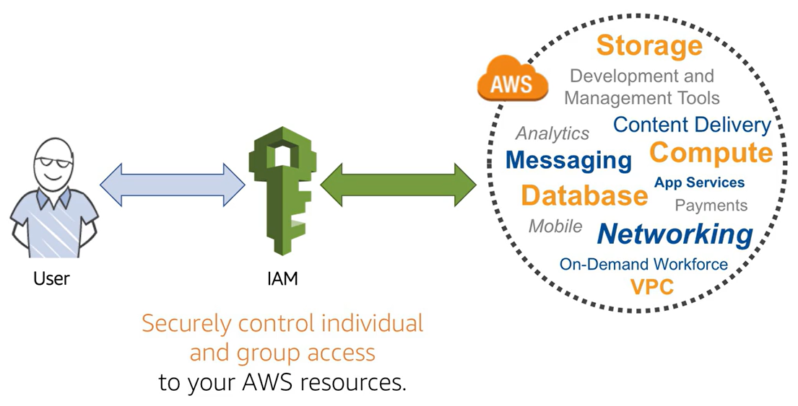

# **AWS Certified Security – Specialty (SCS-C01)**


### AWS Skill Builder

#### Security Learning Plan

https://explore.skillbuilder.aws/learn/learning_plan/view/91/security-learning-plan?la=cta&cta=topbanner


**Vários**

- https://explore.skillbuilder.aws/learn/course/internal/view/elearning/101/getting-started-with-aws-security-identity-and-compliance?ss=sec&sec=prep
- https://explore.skillbuilder.aws/learn/course/internal/view/elearning/485/aws-foundations-securing-your-aws-cloud?trk=c750fe34-f44f-43e1-bcc0-6219228839b9&sc_channel=el
- https://explore.skillbuilder.aws/learn/course/internal/view/elearning/101/getting-started-with-aws-security-identity-and-compliance?trk=c750fe34-f44f-43e1-bcc0-6219228839b9&sc_channel=el
- https://explore.skillbuilder.aws/learn/course/internal/view/elearning/48/aws-security-fundamentals-second-edition?trk=c750fe34-f44f-43e1-bcc0-6219228839b9&sc_channel=el
- https://explore.skillbuilder.aws/learn/course/internal/view/elearning/85/authentication-and-authorization-with-aws-identity-and-access-management?trk=c750fe34-f44f-43e1-bcc0-6219228839b9&sc_channel=el
- https://explore.skillbuilder.aws/learn/course/internal/view/elearning/2045/aws-well-architected?trk=c750fe34-f44f-43e1-bcc0-6219228839b9&sc_channel=el
- https://aws.amazon.com/training/learn-about/security/


### **AWS Videos** 


- **AWS re:Inforce 2019: Best Practices for Choosing Identity Solutions for Applications (FND215)**

  - https://www.youtube.com/watch?v=-xTs4MmQOo4


- **AWS re:Invent 2017: A Deep Dive into AWS Encryption Services (SID329)**

  - https://www.youtube.com/watch?v=gTZgxsCTfbk


- **AWS re:Invent 2015 | (SEC201) How Should We All Think About Security?**

  - https://www.youtube.com/watch?v=fCH4r3s4THQ


- **AWS re:Invent 2017: The AWS Philosophy of Security (SID322)**

  - https://www.youtube.com/watch?v=KJiCfPXOW-U

  

- **AWS re:Invent 2019: [REPEAT 1] AWS Transit Gateway reference architectures for many VPCs (NET406-R1)**

  - https://www.youtube.com/watch?v=9Nikqn_02Oc


- **AWS re:Invent 2019: [REPEAT 1] Getting started with AWS identity (SEC209-R1)**

  - https://www.youtube.com/watch?v=Zvz-qYYhvMk&list=PL2yQDdvlhXf9Ub-ekxAq0wMJpslV562SP&index=25

    

- **AWS re:Invent 2019: [REPEAT 2] The fundamentals of AWS cloud security (SEC205-R2**)

  - https://www.youtube.com/watch?v=QMBkq6MrT2w&list=PLWY0DzS7zQeMPwpQvke2j94sxgFI2o3NM

  

- **Best Practices for DDoS Mitigation on AWS**

  - https://www.youtube.com/watch?v=HnoZS5jj7pk

  

- **AWS re:Invent 2018: [REPEAT 1] Become an IAM Policy Master in 60 Minutes or Less (SEC316-R1)**


  - https://www.youtube.com/watch?v=YQsK4MtsELU


- **Advanced Security Best Practices Masterclass**
  - https://www.youtube.com/watch?v=zU1x5SfKEzs


- **AWS re:Invent 2018: Your Virtual Data Center: VPC Fundamentals and Connectivity Options (NET201)**
  - https://www.youtube.com/watch?v=jZAvKgqlrjY


- **AWS re:Invent 2019: [REPEAT 1] AWS Transit Gateway reference architectures for many VPCs (NET406-R1)**

  - https://www.youtube.com/watch?v=9Nikqn_02Oc

  

- **AWS re:Invent 2018: [REPEAT 1] Become an IAM Policy Master in 60 Minutes or Less (SEC316-R1)**

  - https://www.youtube.com/watch?v=YQsK4MtsELU


- **AWS re:invent 2017: Best Practices for Implementing AWS Key Management Service (SID330)**
  - https://www.youtube.com/watch?v=X1eZjXQ55ec


- **AWS re:Invent 2017: A Deep Dive into AWS Encryption Services (SID329)**
  - https://www.youtube.com/watch?v=gTZgxsCTfbk


\- https://www.youtube.com/playlist?list=PLmiNvfVQRhVM--DXWM5NK5X31RyQfHoYX

https://www.scalefactory.com/events/webinars/2020/07/30/architecture-for-security-on-aws/

https://www.youtube.com/watch?v=YQsK4MtsELU

https://www.twitch.tv/videos/1462506240?filter=all&sort=time


### **AWS Workshops**

https://maturitymodel.security.aws.dev/en/

https://wellarchitectedlabs.com/

https://wellarchitectedlabs.com/security/

http://dfr20cpm485ln.cloudfront.net/SecEng_HLS_index.html

https://awsworkshop.io/

https://github.com/brunokktro/auladobruno#workshops--laborat%C3%B3rios

https://www.wellarchitectedlabs.com/security/?trk=c750fe34-f44f-43e1-bcc0-6219228839b9&sc_channel=el

https://awssecworkshops.com/workshops/?trk=c750fe34-f44f-43e1-bcc0-6219228839b9&sc_channel=el

https://catalog.us-east-1.prod.workshops.aws/workshops/c2f03000-cf61-42a6-8e62-9eaf04907417/en-US/


### AWS FAQ

https://aws.amazon.com/faqs/


### AWS Whitepapper

https://d1.awsstatic.com/whitepapers/aws-kms-best-practices.pdf

https://d1.awsstatic.com/whitepapers/KMS-Cryptographic-Details.pdf

https://d1.awsstatic.com/whitepapers/Security/DDoS_White_Paper.pdf

https://d1.awsstatic.com/whitepapers/compliance/AWS_Security_at_Scale_Logging_in_AWS_Whitepaper.pdf


### The AWS Certification Quiz Show

https://www.twitch.tv/aws/video/467770461✔

https://explore.skillbuilder.aws/learn/course/internal/view/elearning/353/the-aws-certification-quiz-show-security-specialty-exam-episode-1✔

https://explore.skillbuilder.aws/learn/course/external/view/elearning/323/the-aws-certification-quiz-show-security-specialty-exam-episode-2✔

https://explore.skillbuilder.aws/learn/course/external/view/elearning/300/the-aws-certification-quiz-show-security-specialty-exam-episode-3✔


### **AWS Exam Readiness: AWS Certified Security - Specialty**

https://explore.skillbuilder.aws/learn/course/internal/view/elearning/11612/exam-readiness-aws-certified-security-specialty-portuguese

https://explore.skillbuilder.aws/learn/course/internal/view/elearning/97/exam-readiness-aws-certified-security-specialty


## Dojo

https://portal.tutorialsdojo.com/courses/exam-readiness-aws-certified-security-specialty-scs-c01/


## Vários

**AWS Certified Security – Specialty Exam Guide | 3. Access Management**

- https://www.youtube.com/watch?v=VjVpqC0o4oQ&list=PLeLcvrwLe184Q24ljho5Md3Z38VY0keNt


**Amazon AUP**

- https://aws.amazon.com/pt/aup/

  


**AWS Shield Tutorial | AWS Shield Advanced DDOS mitigation theory and hands-on**

- https://www.youtube.com/watch?v=BDeCVOpCsVo

  

- https://www.udemy.com/course/aws-certified-security-specialty-exam/

- https://www.scalefactory.com/events/webinars/2020/07/30/architecture-for-security-on-aws/

- https://github.com/brunokktro/auladobruno#security-engineering-on-aws


# Services


### AWS Abuse Report

https://aws.amazon.com/pt/aup/


## Analytics


- - 


## Business Applications

### **AWS SES - Simple Email Services**

https://aws.amazon.com/pt/ses/

**Summary**

- Configurar um **VPC Endpoint com AWS PrivateLink** para alcançar dentro da VPC
- Access SES to EC2
  - Configure SG for communication SMTP endpoint
    - 3 endpoints 
  - Portas 587 or 2587
  - Port 25 default - Throttles 


## **Compute**

### **EC2 (Elastic Compute Cloud)**

- Serviço que vc tem controle total

- **EC2 Instance Connect**

  - Conecta na EC2 via console AWS

- **EC2 UserData**

  - bootstrap
  - executa no primeiro boot

- **SO**

  - Linux, Windows e MAcOS

- **Benefícios da EC2**

  - Elasticidade, Flexível
  - Integração com demais serviços
  - Confiável
  - Seguro
  - Baixo Custo

- **Tipos de Instâncias**

  https://aws.amazon.com/pt/ec2/instance-types/

  - **General Purpose**

    - Instâncias de uso geral fornecem um equilíbrio de recursos de computação, memória e rede e podem ser usadas para diversas cargas de trabalho.

  - **Compute Optimized**

    - As instâncias otimizadas para computação são ideais para aplicativos vinculados a computação que se beneficiam de processadores de alto desempenho.
      - Batch
      - Media
      - HPC
      - Machine Learning

  - **Memory Optimized**

    - As instâncias otimizadas de memória são projetadas para fornecer desempenho rápido para cargas de trabalho que processam grandes conjuntos de dados na memória.

  - **Accelerated Computing**

    - Instâncias de computação aceleradas usam aceleradores de hardware, ou coprocessadores, para executar funções, como cálculos de número de ponto flutuante, processamento de gráficos ou correspondência de padrões de dados, mais eficientemente do que é possível no software em execução nas CPUs.

  - **Storage Optimized**

    - As instâncias otimizadas para armazenamento são projetadas para cargas de trabalho que exigem acesso de leitura e gravação sequencial alto a conjuntos de dados muito grandes no armazenamento local. Elas

  - **Instances Features**

  - **Measuring Instance Performance**

    

- **EC2 Dedicated Hosts**

  https://docs.aws.amazon.com/AWSEC2/latest/UserGuide/dedicated-hosts-overview.html

  https://aws.amazon.com/pt/ec2/dedicated-hosts/

  - Podem utilizar licenças de software existentes no cliente - BYOL

  - Tudo no mesmo servidor, deploys

    

- **EC2 Dedicated Instances**

  https://aws.amazon.com/pt/ec2/pricing/dedicated-instances/

  - Roda em hardware dedicado mas vc não tem acesso

    

- **EC2 Dedicated Instances vs EC2 Dedicated Hosts**


- **Preços**

  - **Sob-Demanda**

    **https://aws.amazon.com/blogs/aws/new-per-second-billing-for-ec2-instances-and-ebs-volumes/**

    - **Por hora ou por segundo**
    - **60 segundos é a cobrança mínima**

  - **Saving Plans**

    - 1 ou 3 anos
    - **Até 72% de desconto comparado ao sob-demanda**
    - **EC2 Saving Plans**
      - **Até 72% de descontos**
      - Individual instances
    - **Compute Saving Plans**
      - Mais flexível
      - EC2, Fargate e Lambda

  - **Instâncias Reservadas**

    - 1 ou 3 Anos
    - Standard, Convertable ou Scheduled

  - **Instâncias Spot**

    https://aws.amazon.com/ec2/spot/

    - Aviso de até **2 minutos**
    - **Até 90% de desconto comparado ao sob-demanda**
    - Cargas de trabalhos em lote


### **AWS Hypervisor**

https://aws.amazon.com/pt/ec2/nitro/

VMM


### **Elastic Block Store (EBS)**

https://aws.amazon.com/pt/ebs/

- Armazenamento a nível de bloco

- Independente da vida útil da instância

- **Snapshots são armazenados de forma incremental, é cobrado pelos blocos alterados armazenados**

- **É automaticamente replicado entre AZ´s**

- **Mas é armazenado em uma única AZ**

- É cobrado pelo Tipo e pelo IOPS provisionado.

- Snapshot point-in-time

- Snapshots podem ser copiados entre Regiões

- Memory scrubbing

  https://d1.awsstatic.com/whitepapers/Security/Security_Compute_Services_Whitepaper.pdf

- Ate 16 TiB

- **Pode ser anexado a uma única instância na mesma Zona de disponibilidade**

- Flag - Delete on Termination

  - Para deletar o EBS quando deleta a EC2
  - Não vem ativado por default


### **Elastic Load Balancing (ELB)**

https://aws.amazon.com/pt/elasticloadbalancing/

- **Tipos**
  - **Gateway**
  - **Application**
    - (http/https only)
    - Layer 7
  - **Network**
    - (ultra-high performance / TCP)
    - Layer 4
  - Classic
    - (Layer 4 and Layer 7)
- É regional
- É altamente disponível


## Containers

### **Container Security**

https://aws.amazon.com/blogs/compute/maintaining-transport-layer-security-all-the-way-to-your-container-part-2-using-aws-certificate-manager-private-certificate-authority/

**Best Pratices**

- Não compartilhe Secrets and Passwords dentro do containers
- não executar contiainer com root
- Use roles
- Encryption In Transit using TLS
- Use Amazon Certificate Manager
- Use Secret Manager
- Evite usar
  - Imagens publicas
  - Bibliotecas desnecessárias 


## Management & Governance


### **AWS Organizations**

https://aws.amazon.com/pt/organizations/


- **Summary**
  - Global Service
  - Para automatizar a criação de AWS Accounts
  - Gerenciamento centralizado de todas as contas
  - Agrupamento - OU
  - Controle de serviços/API por conta
  - Habilita CloudTrail em todas as contas para enviar os Log´s para um Bucket S3 central
  - Envia todos os CloudWatch Logs para uma conta central
  - **Para remover uma conta, a conta AWS deve ser capaz de operar como uma conta autônoma. Só então ele pode ser removido das organizações AWS**
- **Consolidated Billing**
  - Descontos
    - Volume
    - Reserved Instances
      - **Só recebe os descontos se as EC2 estiverem na mesma AZ**
    - Saving Plans
  - Uma invoice
- **Service Control Polices (SCP)**
  - Política da organização que você pode usar para gerenciar permissões em sua organização.
  - Um SCP abrange todos os usuários, grupos e funções do IAM, incluindo o usuário raiz da conta da AWS.
  - Whitelist e Black List
  - Apply OU ou Account level
  - Não é aplicado na conta Master
  - Aplica em todos os usuários e roles, incluindo o root
  - Deve ter a permissão **Explicito**


## Networking & Content Delivery


### Amazon CloudFront

**Geo Restrictions**

https://docs.aws.amazon.com/pt_br/AmazonCloudFront/latest/DeveloperGuide/georestrictions.html

Para impedir que usuários em localizações geográficas específicas acessem o conteúdo que você está distribuindo por meio de uma distribuição do CloudFront.


Segurança no S3

- Restrict access bucket vem DENY por padrão
- Origin
  - Restric bucket Access - Yes
  - Origin Access Identity - Create a new Identity
- SSL Certificates
  - Default Cloudfront
    - Veem c/ nome aleatório
    - domínio cloudfront.net
  - Custom SSL
    -  Tem que importar certificado
    -  seu domínio
    -  ACM somente em us-east-1


### **Route53**

https://aws.amazon.com/pt/route53/

**Summary**

- Pode registrar nomes de domínios
- Você pode comprar e registrar os domínios e  pode entender o período 

- Pode monitorar a saúde e o desempenho de seu aplicativo, bem como de seus servidores da web e outros recursos.
  - DNS


Routing Policies

https://docs.aws.amazon.com/Route53/latest/DeveloperGuide/routing-policy.html

- **Simple routing policy** (Política de roteamento simples)

  - Use para um único recurso que executa uma determinada função para seu domínio, por exemplo, um servidor Web que oferece conteúdo para o site example.com.

  - No health checks

    

- **Failover routing policy** (Política de roteamento de failover)

  - Use quando quiser configurar o failover **ativo-passivo**.

  - **Yes health checks**

    

- **Geolocation routing policy** (Política de roteamento de localização geográfica)

  - Use quando quiser encaminhar o tráfego com base na localização dos usuários.

    

- **Geoproximity routing policy** (Política de roteamento de proximidade geográfica)

  - Use quando quiser encaminhar o tráfego com base no local de seus recursos e, opcionalmente, alternar o tráfego de recursos em um local para recursos em outro local.

    

- **Latency routing policy** (Política de roteamento de latência):

  - Use quando você tiver recursos em várias regiões da AWS e quiser encaminhar o tráfego para a região que fornece o menor tempo de ida e volta.

  - Para melhor performance de usuários globais

    

- **Multivalue answer routing policy** (Política de roteamento de resposta com vários valores):

  - Use quando quiser que o Route 53 responda a consultas de DNS com até oito registros íntegros selecionados aleatoriamente.

    

- **Weighted routing policy** (Política de roteamento ponderado):

  - Use para encaminhar o tráfego para vários recursos nas proporções que você especificar.

  - Permite associar vários recursos a um único nome de domínio (example.com) ou nome de subdomínio (acme.example.com) e escolher quanto tráfego é roteado para cada recurso.


### **API Gateway**

**Summary**

- Expõe API´s
- Serverless
- RestFull e Websocket


## Security, Identity, & Compliance


### AWS Identity ans Access Management (IAM)

https://docs.aws.amazon.com/iam/index.html



Summary

- Controle de acesso para recursos
- MFA
  - Virtual MFA Devices (Google Autenticator or Authy)
  - Universal 2nd Factor (U2F) Security Key - **Phisical Device**
  - Hardware Key Fob MFA Device
  - Hardware Key Fob MFA Device for AWS GovCloud (US)
- **Serviço Global**
- Analise de acesso
- Por padrão um usuário não tem permissões - **tudo negado por default**


**IAM Users**

- **Users**
  - Podemos ter um usuário em mais de um grupo


**IAM Policies**

https://docs.aws.amazon.com/pt_br/IAM/latest/UserGuide/access_policies.html

- json

- **3 tipos de policies**

  - **AWS Managed Policies**

    - Políticas gerenciadas que são criadas e gerenciadas pela AWS.

    - Você pode alterar

      

  - **Customer Managed Policies**

    - Políticas gerenciadas que você criar e gerenciar em sua conta da AWS. 

    - As políticas gerenciadas pelo cliente oferecem um controle mais preciso de suas políticas do que as políticas gerenciadas pela AWS.

      

  - **Inline Policies**

    - Políticas adicionadas diretamente a um único usuário, grupo ou função. 

    - As políticas em linha mantêm um relacionamento estrito de um para um entre uma política e uma identidade. 

    - Elas são excluídas quando você exclui a identidade.

      

- Estrutura de uma Policy

  

  

**Simple Policy**


**IAM Roles**

- Identidades que podem assumir
- Assumidas temporária
- Permissões associadas
- Não podem ser utilizadas por usuários, somente por **AWS Services**
- IAM Users, app and services may assume IAM Roles
- Uses an IAM policy for permissions


**IAM Groups**

- Agrupamentos de usuários com permissões em comum

- Grupos só tem usuários e não pode ter outros Grupos

  


**Security Tools**

- **IAM Credentials Report (account-level)**

  - Report que lista todos os usuários de sua conta e o status de suas várias credenciais

  - É armazenado por até quatro horas

  - Não é usado para revisar as permissões concedidas a um usuário.

    

- **IAM Access Advisor (user-level)**

  - Mostra os serviços que este usuário pode acessar e quando esses serviços foram acessados pela última vez
  - Lista atividades de ate 4 horas
  - Você pode identificar permissões desnecessárias para que possa revisar suas políticas de IAM de acordo


Best Practices

https://docs.aws.amazon.com/IAM/latest/UserGuide/best-practices.html


**IAM Authorization**


**IAM Authentication**


**IAM Credential Report**

https://docs.aws.amazon.com/pt_br/IAM/latest/UserGuide/id_credentials_getting-report.html

- Report que lista todos os **usuários** de sua conta e o status de suas várias credenciais
- É armazenado por até quatro horas
- Não é usado para revisar as permissões concedidas a um usuário.
- **Usuários, Passwords, Access Keys, MFA**
- Exemplo


**Obter relatórios de credenciais (AWS CLI)**

**Para fazer download um relatório de credenciais (AWS CLI)**

1. Gere um relatório de credenciais. O AWS armazena um único relatório. Se um relatório existir, a geração de um relatório de credenciais substituirá o relatório anterior. [`aws iam generate-credential-report`](https://docs.aws.amazon.com/cli/latest/reference/iam/generate-credential-report.html)
2. Exibir o último relatório gerado: [`aws iam get-credential-report`](https://docs.aws.amazon.com/cli/latest/reference/iam/get-credential-report.html)


**Obter relatórios de credenciais (API da AWS)**

**Para fazer download de um relatório de credenciais (API AWS)**

1. Gere um relatório de credenciais. O AWS armazena um único relatório. Se um relatório existir, a geração de um relatório de credenciais substituirá o relatório anterior. [`GenerateCredentialReport`](https://docs.aws.amazon.com/IAM/latest/APIReference/API_GenerateCredentialReport.html)
2. Exibir o último relatório gerado: [`GetCredentialReport`](https://docs.aws.amazon.com/IAM/latest/APIReference/API_GetCredentialReport.html)


**Permissões necessárias**

p/ criar - generatecredentialreport

p/ download - getcredentialreport


**AWS Security Token Service (STS)**

https://docs.aws.amazon.com/pt_br/IAM/latest/UserGuide/id_credentials_temp_enable-regions.html


Acesso limitado e temporario a recursos da AWS.

- Federetion (typically Active Directory)
  - use SALM
- Federetion with Mobile Apps
- Cross Account Access
- Key Terms
  - Federation
  - Identity Broker
  - Identity Store - Serviços como AD, Facebook, Google e etc.
  - Indentities


### Amazon Cognito

https://aws.amazon.com/cognito/

- Federação de Identidade

  - Web Facebook, Google

  - Mobile

    


User Identity


Cognito User Pools

https://docs.aws.amazon.com/pt_br/cognito/latest/developerguide/cognito-user-identity-pools.html

https://aws.amazon.com/premiumsupport/knowledge-center/cognito-user-pools-identity-pools/

https://tutorialsdojo.com/amazon-cognito-user-pools-and-identity-pools-explained/

**São utilizados para autenticação.**

User Pools é um diretório de usuários no Amazon Cognito. Com um grupo de usuários, seus usuários podem fazer login em aplicações Web ou móveis por meio do Amazon Cognito. 

Os usuários também podem fazer login por meio de provedores de identidade social, como o Google, o Facebook, a Amazon ou a Apple, e por meio de provedores de identidade SAML. 

Quer os usuários façam login diretamente ou por meio de terceiros, todos os membros do grupo de usuários têm um perfil de diretório que você pode acessar por meio de um Kit de desenvolvimento de software (SDK).

Os grupos de usuários fornecem:

- Serviços de cadastro e login.
- Uma interface do usuário da web integrada e personalizável para login de usuários.
- Login social com Facebook, Google, Login with Amazon e Iniciar sessão com a Apple, além de login com provedores de identidade SAML a partir do seu grupo de usuários.
- Gerenciamento de diretório de usuários e perfis de usuário.
- Recursos de segurança como a autenticação multifator (MFA) verifica a existência de credenciais comprometidas, proteção de aquisição de conta e verificação de e-mail e telefone.
- Fluxos de trabalho personalizados e migração de usuários por meio de triggers do AWS Lambda.

Após autenticar com êxito um usuário, o Amazon Cognito emite JSON Web Tokens (JWT) que você pode usar para proteger e autorizar o acesso às suas próprias APIs ou trocar por credenciais da AWS.


1. Os usuários enviam solicitações de autenticação para os User Pool do Cognito. 

2. O  User Pool do Cognito verifica a identidade do usuário ou envia a solicitação para Identity Providers, como Facebook, Google, Amazon ou autenticação SAML (com Microsoft AD).

3. O token do  User Pool do Cognito é enviado de volta ao usuário. 

4. A pessoa pode usar esse token para acessar suas APIs de back-end hospedadas em seus clusters do EC2 ou no API Gateway e Lambda.

   

**Casos de uso**

- [Crie páginas da Web de inscrição e login para seu aplicativo](https://aws.amazon.com/premiumsupport/knowledge-center/cognito-hosted-web-ui/) .
- [Acesse e gerencie os dados do usuário](https://docs.aws.amazon.com/cognito/latest/developerguide/user-pool-settings-attributes.html) .
- Rastreie o dispositivo, a localização e o endereço IP do usuário e [adapte-se às solicitações de entrada de diferentes níveis de risco](https://docs.aws.amazon.com/cognito/latest/developerguide/cognito-user-pool-settings-adaptive-authentication.html) .
- Use um [fluxo de autenticação personalizado](https://docs.aws.amazon.com/cognito/latest/developerguide/amazon-cognito-user-pools-authentication-flow.html#amazon-cognito-user-pools-custom-authentication-flow) para seu aplicativo.


**Cognito Identity Pools**

https://docs.aws.amazon.com/pt_br/cognito/latest/developerguide/identity-pools.html

**São utilizados para autorização.**

Identity Pools do Amazon Cognito fornecem credenciais temporárias da AWS para usuários que são convidados (não autenticados) e para usuários que foram autenticados e receberam um token.

 Um Identity Pools é um repositório de dados de identidade de usuários específicos para sua conta.

**Casos de uso**

- Dê a seus usuários [acesso a recursos da AWS](https://docs.aws.amazon.com/cognito/latest/developerguide/iam-roles.html) , como um bucket do Amazon Simple Storage Service (Amazon S3) ou uma tabela do Amazon DynamoDB.
- Gere [credenciais temporárias da AWS para usuários não autenticados](https://docs.aws.amazon.com/cognito/latest/developerguide/switching-identities.html) .


1. O aplicativo Web ou aplicativo móvel envia seu token de autenticação para Cognito Identity Pools. O token pode vir de um provedor de identidade válido, como Cognito User Pools, Amazon ou Facebook. 
2. O Cognito Identity Pool troca o token de autenticação do usuário por credenciais temporárias da AWS para acessar recursos como S3 ou DynamoDB. As credenciais da AWS são enviadas de volta ao usuário. 
3. As credenciais temporárias da AWS serão usadas para acessar os recursos da AWS. 


Federetion with User Pools


**Web Identity Federation**


### AWS CloudHSM 

**(Hardware Security Module – Módulo de segurança de hardware)** 

https://aws.amazon.com/pt/cloudhsm/

O AWS CloudHSM é baseado na nuvem que permite gerar e usar facilmente suas próprias chaves de criptografia na Nuvem AWS. 

Com o CloudHSM, você pode gerenciar suas próprias chaves de criptografia usando HSMs validados pelo FIPS 140-2 nível 3 e EAL-4

O CloudHSM oferece a flexibilidade de integrar-se aos seus aplicativos usando APIs padrão do setor, como bibliotecas Microsoft CryptoNG (CNG), PKCS#11 e Java Cryptography Extensions (JCE).

- **AWS não tem acesso as suas keys**


### AWS Directory Service

https://docs.aws.amazon.com/directoryservice/latest/admin-guide/what_is.html

O AWS Directory Service oferece várias maneiras de usar o Microsoft Active Directory (AD) com outros serviços da AWS. Os diretórios armazenam informações sobre usuários, grupos e dispositivos, e os administradores os usam para gerenciar o acesso a informações e recursos.


**AWS Managed Microsoft AD**

https://docs.aws.amazon.com/directoryservice/latest/admin-guide/ms_ad_use_cases.html

Também conhecido como AWS Managed Microsoft AD, o AWS Directory Service for Microsoft Active Directory é desenvolvido por um Microsoft Windows Server Active Directory (AD) real, gerenciado pela AWS na Nuvem AWS. Ele permite que você migre uma ampla variedade de aplicativos com reconhecimento do Active Directory para a Nuvem AWS. 


**Active Directory Connector**

O AD Connector é um serviço de proxy que oferece uma maneira fácil de conectar aplicativos compatíveis da AWS, como Amazon WorkSpaces, Amazon QuickSight e [Amazon EC2](https://aws.amazon.com/ec2/)para instâncias do Windows Server, para o Microsoft Active Directory local existente. Com o AD Connector, você pode simplesmente [adicionar uma conta de serviço](https://docs.aws.amazon.com/directoryservice/latest/admin-guide/prereq_connector.html#connect_delegate_privileges) ao seu Active Directory. O AD Connector também elimina a necessidade de sincronização de diretórios ou o custo e a complexidade de hospedar uma infraestrutura de federação.


**Simple Active Directory**

*O Simple AD é um diretório compatível* com o Microsoft Active Directory do AWS Directory Service que é desenvolvido pelo Samba 4. O Simple AD oferece suporte a recursos básicos do Active Directory, como contas de usuário, associações a grupos, ingresso em um domínio Linux ou instâncias EC2 baseadas em Windows, SSO baseado em Kerberos e políticas de grupo. A AWS fornece monitoramento, instantâneos diários e recuperação como parte do serviço.


### AWS Single Sign-On

- **Summary**

  - SAML 2.0
  - Login em múltiplas contas

- **Integrado com**

  - AD On Premises

  - AWS Organizations

  - Business app - Dropbox, Slack, Office 365

  - Custom App


### **AWS KMS (Key Management Service)**

**`Caiu muito`**

https://aws.amazon.com/kms/features/

https://aws.amazon.com/pt/kms/faqs/

https://d0.awsstatic.com/whitepapers/aws-kms-best-practices.pdf

O AWS Key Management Service (KMS) oferece a você controle centralizado das chaves criptográficas usadas para proteger seus dados.

Summary

- Usa Envelope Encryption

- Com **Admin** é possível acessar arquivos criptografados 

- É Regional

- Pode trazer sua própria key

- Serviços integrados 

  - EBS, RDS, EFS, S3, Redshift
  - https://aws.amazon.com/pt/kms/features/#AWS_Service_Integration

- Schedule key deletion

  - Mínimo de 7 dias e máximo de 30 para deletar a key

- Deleting a key makes all data encrypted under that key unrecoverable

  - https://docs.aws.amazon.com/pt_br/kms/latest/developerguide/deleting-keys.html#deleting-keys-how-it-works

- Create an Amazon CloudWatch alarm that alerts you about any attempts to use the key(s) during the waiting period

  - https://docs.aws.amazon.com/pt_br/kms/latest/developerguide/deleting-keys-creating-cloudwatch-alarm.html

- Pode habilitar o uso da key em outras contas durante a criação

- 265-bit

- Não tem rotação automática das keys

- Key Deletetion

  - Vem habilitado por padrão
  - Allow key administrators to delete this key.

- 2 tipos de keys

  - Symmetric
  - Asymmetric


**Key material origin**

https://docs.aws.amazon.com/pt_br/kms/latest/developerguide/concepts.html#key-origin

- KMS

- Mínimo de 7 dias e máximo de 30 para deletar a key

- Não tem rotação automática

- External

  https://docs.aws.amazon.com/pt_br/kms/latest/developerguide/importing-keys.html#importing-keys-considerations

  - **Encrypted key material and import token**
  - Pode setar a expiração da key

- Custom key store (CloudHSM)


**Grants**

https://docs.aws.amazon.com/pt_br/kms/latest/developerguide/grants.html

- Acesso temporário 

- Exemplos

  ```shell
  #Create a new key and make a note of the region you are working in 
  aws kms create-key
  
  #Test encrypting plain text using my new key: 
  aws kms encrypt --plaintext "hello" --key-id <key_arn>
  
  #Create a new user called Dave and generate access key / secret access key
  aws iam create-user --user-name dave
  aws iam create-access-key --user-name dave
  
  #Run aws configure using Dave's credentials creating a CLI profile for him
  aws configure --profile dave
  aws kms encrypt --plaintext "hello" --key-id <key_arn> --profile dave
  
  #Create a grant for user called Dave
  aws iam get-user --user-name dave
  aws kms create-grant --key-id <key_arn> --grantee-principal <Dave's_arn> --operations "Encrypt"
  
  #Encrypt plain text as user Dave: 
  aws kms encrypt --plaintext "hello" --key-id <key_arn> --grant-tokens <grant_token_from_previous_command> --profile dave
  
  #Revoke the grant:
  aws kms list-grants --key-id <key_arn>
  aws kms revoke-grant --key-id <key_arn> --grant-id <grant_id>
  
  #Check that the revoke was successful:
  aws kms encrypt --plaintext "hello" --key-id <key_arn> --profile dave
  
  https://docs.aws.amazon.com/cli/latest/reference/kms/create-grant.html
  ```

  

**Cross Account Access**

https://docs.aws.amazon.com/pt_br/kms/latest/developerguide/key-policy-modifying-external-accounts.html


**Policy Conditions**

https://docs.aws.amazon.com/pt_br/kms/latest/developerguide/policy-conditions.html

- kms: viaservice

  - Allow or Deny pear Service

  - https://docs.aws.amazon.com/pt_br/kms/latest/developerguide/policy-conditions.html#conditions-kms-via-service

  - Exemplo

  - ```yaml
    {
      "Effect": "Allow",
      "Principal": {
        "AWS": "arn:aws:iam::111122223333:user/ExampleUser"
      },
      "Action": [
        "kms:Encrypt",
        "kms:Decrypt",
        "kms:ReEncrypt*",
        "kms:GenerateDataKey*",
        "kms:CreateGrant",
        "kms:ListGrants",
        "kms:DescribeKey"
      ],
      "Resource": "*",
      "Condition": {
        "StringEquals": {
          "kms:ViaService": [
            "ec2.us-west-2.amazonaws.com",
            "rds.us-west-2.amazonaws.com"
          ]
        }
      }
    }
    ```

    


**Key Rotation Options**

https://docs.aws.amazon.com/kms/latest/developerguide/rotate-keys.html

https://d1.awsstatic.com/whitepapers/aws-kms-best-practices.pdf

- Best Pratice
- Rotação com frequência (a cada 3 anos)
- AWS Managed, Customer Managed with imported key material
- AWS Managed Keys não podem ser deletadas


**Regionality**

https://docs.aws.amazon.com/pt_br/kms/latest/developerguide/multi-region-keys-overview.html

- Single-Region key
- Multi-Region key


**The Customer Master Key(CMK)**

- **Customer Managed CMK**

  - Uma chave mestra do cliente (CMK) é uma representação lógica de uma chave mestra.

  - O CMK inclui metadados, como Alias, ID da chave, Data de criação, Descrição e key state.

  - O CMK também contém o material chave usado para criptografar e descriptografar dados.

  - **Eles são criados e gerenciados pelo cliente AWS.**

  - O acesso a eles pode ser controlado usando o serviço AWS IAM.

  - Create, Manage and used

  - Enable and Disable

  - **NUNCA PODE SER EXPORTADA**

    

- **AWS Managed CMK**

  - São CMKs em sua conta que são criados, **gerenciados e usados em seu nome por um serviço AWS** que está integrado com AWS KMS.
  - Used AWS Services
  - Create, Manage and used
  - Rotaciona a cada 3 anos automaticamante
  - Não pode ser deletada

  

- **AWS Owned CMK**

  - São uma coleção de CMKs que um serviço da AWS possui e gerencia para uso em várias contas da AWS.
  - Não estão em sua conta da AWS.
  - **Você não pode visualizar ou gerenciar esses CMKs.**
  - Utilzado em multiplas contas

  

- **CloudHMS Keys**

  - Keys generated from CloudHSM hardware device


### **AWS Secrets Manager**

https://aws.amazon.com/pt/secrets-manager/

**Summary**

- Rotação de secrets

- Integra com RDS

- **In-trasit and at rest using KMS**

- Schedule Delete Secret

  - Between 7 - 30 days
  - Default 7

- You Pay

- Language app 

  - Java
  - Javascript
  - C#
  - Python3
  - Ruby
  - Go

- Enable automatic rotation 

  - Vem desativado por padrão
  - Seleciona o intervalo de rotação (default - 30 dias)
  - Cria uma lambda function para rotação

- Use cases

  - Database credentials

  - RDS credentials

  - Outros (API Key)

  - **Rotation secrets** // But be careful


### **AWS Certificate Manager** (ACM)

https://aws.amazon.com/pt/certificate-manager/

https://docs.aws.amazon.com/acm/latest/userguide/managed-renewal.html

É um serviço que permite provisionar, gerenciar e implantar facilmente certificados **Secure Sockets Layer (SSL)/Transport Layer Security (TLS)** para uso com os serviços da AWS e os recursos internos conectados.

- Free Service
- Pode atualizar e renovar certificados HTTPS (SSL´s)
- Não pode exportar certificados gerenciados pela AWS
- Pode importar o seu certificado

  - Não renova certificados importados automaticamente 
- 2 tipos de validação

  - DNS
    - Add CNAME na zona de DNS criada

    - Renova o certificado automático

  - E-mail
    - Envia um e-mail
- Renovação automática
- SSL/TSL
- Integra
  - ELB
  - Cloudfornt
  - API Gateway


### AWS Artifact

https://aws.amazon.com/pt/artifact/

**Summary**

- Acesso aos relatórios emitidos pelo auditor da AWS
  - ISO
  - PCI
  - SOC Reports
- **Não é um serviço AWS**


### **AWS Shield**

https://aws.amazon.com/pt/shield/?whats-new-cards.sort-by=item.additionalFields.postDateTime&whats-new-cards.sort-order=desc

- **Shield Standard**

  - Usa machine learning

  - Protege contra Ataque DDoS

  - Fornece proteção para:

    - ELB´s

    - Cloudfront

    - Route 53

  - Layer 3 / Layer 4

  - Está sob a responsabilidade da AWS no **Shared Responsability Model** 

    

- **Shield Advanced**

  - **No shield advanced vc tem acesso ao time AWS DDoS Response Team (DRT)**
  - $3000 p/ mês - se vc for vitima de um ataque vc não paga 
  - Fornece proteção extendida para:
    - Amazon Elastic Compute Cloud
    - Elastic Load Balancing (ELB)
    - Amazon CloudFront
    - Amazon Route 53
    - AWS Global Accelerator


## The AWS Well-Architected Framework


### Operational Excellence

### Security

#### Identity and Access Management

##### Serviços

- Amazon Cognito
- AWS Directory Service
- AWS Identity ans Access Management (IAM)
- AWS Single Sign-On


#### Detective Controls

#### Infrastructure Protection

#### Data Protection

#### Incident Reponse

### Reliability

### Performance Efficiency

### Cost Optimization


## **Security OF AWS**


### **Shared Responsability Model**

https://aws.amazon.com/pt/compliance/shared-responsibility-model/


- **Infraestrutura Global** não faz parte dos controles compartilhados entre Cliente e AWS.


## **Security IN AWS**

**AWS Config**

**AWS CloudTrail**

**AWS KMS**

**AWS CloudHSM**
