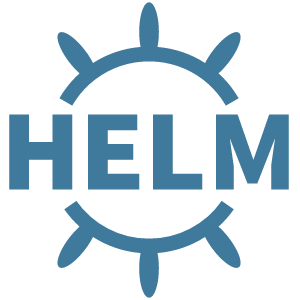

# **Helm**




[`Kubernetes Helm`](https://github.com/kubernetes/helm) é uma ferramenta para gerenciar pacotes de recursos pré-configurados do Kubernetes, também conhecidos como Kubernetes charts.

Use o Helm para:

- Encontrar e usar softwares populares empacotados como Kubernetes charts
- Compartilhar seus próprios aplicativos como Kubernetes charts
- Criar builds reproduzíveis de seus aplicativos Kubernetes
- Gerenciar de forma inteligente os arquivos de manifesto do Kubernetes
- Gerenciar versões dos pacotes Helm

# **Treinamentos**

Colocar ✔ quando concluído. 

## Linux Tips

### **Descomplicando Kubernetes - Helm**

- https://github.com/devfuckops/DescomplicandoHelm
- https://github.com/devfuckops/DescomplicandoKubernetes/blob/main/day-4/DescomplicandoKubernetes-Day4.md#helm

## 

## **acloudguru**

### **Helm Deep Dive V3**

- https://learn.acloud.guru/course/helm-deep-dive-v3/overview


# **Documentação**

- https://helm.sh/pt/docs/helm/helm/

- https://helm.sh/pt/docs/intro/quickstart/


## **Instalando Helm**

- https://helm.sh/pt/docs/intro/install/


## **Charts**

- https://artifacthub.io/

- https://helm.sh/docs/topics/charts/

### The Chart File Structure

- https://helm.sh/docs/topics/charts/#the-chart-file-structure

Estrutura do Chart

```yaml
wordpress/
  Chart.yaml          # A YAML file containing information about the chart
  LICENSE             # OPTIONAL: A plain text file containing the license for the chart
  README.md           # OPTIONAL: A human-readable README file
  values.yaml         # The default configuration values for this chart
  values.schema.json  # OPTIONAL: A JSON Schema for imposing a structure on the values.yaml file
  charts/             # A directory containing any charts upon which this chart depends.
  crds/               # Custom Resource Definitions
  templates/          # A directory of templates that, when combined with values,
                      # will generate valid Kubernetes manifest files.
  templates/NOTES.txt # OPTIONAL: A plain text file containing short usage notes
```


### The Chart.yaml File

- https://helm.sh/docs/topics/charts/#the-chartyaml-file

```yaml
apiVersion: The chart API version (required)
name: The name of the chart (required)
version: A SemVer 2 version (required)
kubeVersion: A SemVer range of compatible Kubernetes versions (optional)
description: A single-sentence description of this project (optional)
type: The type of the chart (optional)
keywords:
  - A list of keywords about this project (optional)
home: The URL of this projects home page (optional)
sources:
  - A list of URLs to source code for this project (optional)
dependencies: # A list of the chart requirements (optional)
  - name: The name of the chart (nginx)
    version: The version of the chart ("1.2.3")
    repository: (optional) The repository URL ("https://example.com/charts") or alias ("@repo-name")
    condition: (optional) A yaml path that resolves to a boolean, used for enabling/disabling charts (e.g. subchart1.enabled )
    tags: # (optional)
      - Tags can be used to group charts for enabling/disabling together
    import-values: # (optional)
      - ImportValues holds the mapping of source values to parent key to be imported. Each item can be a string or pair of child/parent sublist items.
    alias: (optional) Alias to be used for the chart. Useful when you have to add the same chart multiple times
maintainers: # (optional)
  - name: The maintainers name (required for each maintainer)
    email: The maintainers email (optional for each maintainer)
    url: A URL for the maintainer (optional for each maintainer)
icon: A URL to an SVG or PNG image to be used as an icon (optional).
appVersion: The version of the app that this contains (optional). Needn't be SemVer. Quotes recommended.
deprecated: Whether this chart is deprecated (optional, boolean)
annotations:
  example: A list of annotations keyed by name (optional).
```


### Inicialize um Repositório para os Charts do Helm

- https://helm.sh/pt/docs/intro/quickstart/#inicialize-um-reposit%C3%B3rio-para-os-charts-do-helm


### **Comandos**

| Comandos                                                     | Descrição                                    |
| ------------------------------------------------------------ | -------------------------------------------- |
| helm repo add stable https://charts.helm.sh/stable           | Add Repo Stable                              |
| helm repo list                                               | Lista repositórios                           |
| helm search repo "*palavra-chave*"                           | Procura por repositórios com a palavra chave |
| helm search hub "*palavra-chave*"                            | Procura por chats com a palavra chave        |
| helm repo update                                             | Atualiza Repos                               |
| helm list                                                    | Mostra os Helm´s instalados                  |
| helm status "*nomedochart*"                                  | Status do chart                              |
| helm uninstall "*nomedochart*"                               | Remove o chart                               |
| helm show chart "*nomedochart*" (helm show chart bitnami/mysql) | Descrição do Chart                           |
| helm install "nome" "diretório/" --values "diretório"/values.yaml | Instalar repo local                          |
| helm upgrade "nome" "diretório/" --values "diretório"/values.yaml | Upgrade                                      |
| helm rollback giropops 1                                     | Rollback                                     |
| helm history giropops                                        | Histórico de versões                         |
|                                                              |                                              |


# **Links Úteis**

**Site Oficial**

https://helm.sh/


**Helm — O que é, e porque você deve usá-lo**

https://medium.com/@maths.nunes/o-que-%C3%A9-o-helm-e-porque-voc%C3%AA-deve-us%C3%A1-lo-508b7350dcd


